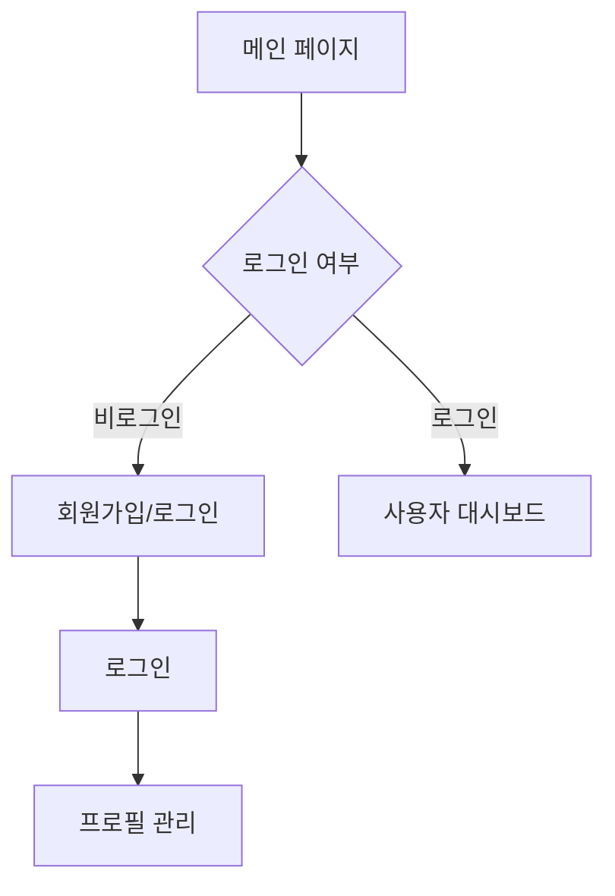
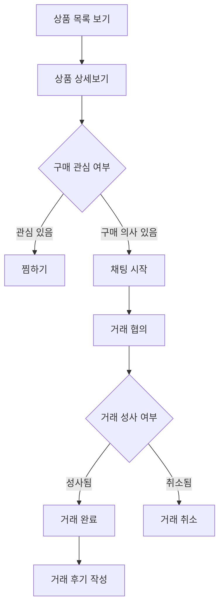
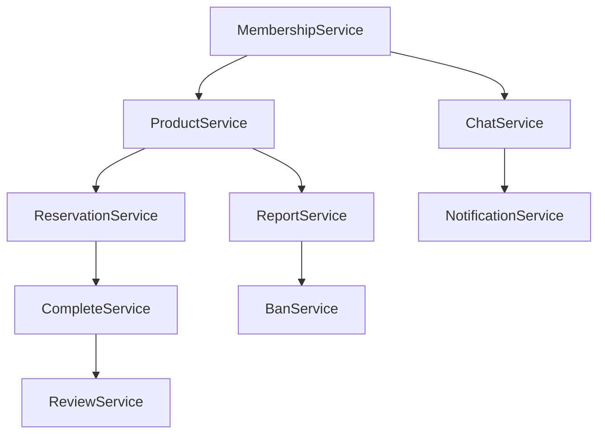

# 도메인 설계서

## 문서 정보

- **프로젝트명**: [루키장터]
- **작성자**: [팀명/오유식, 지재현]
- **작성일**: [2025-05-27]
- **버전**: [v1.0]
- **승인자**: [지재현]

---

## 1. 프로젝트 개요

### 1.1 프로젝트 목적

> 중고 거래 웹 서비스 개발

**예시:**

```
중고 거래를 원하는 이용자가 위치 기반 시스템을 통해 거래
```

### 1.2 프로젝트 범위

**포함 범위:**

- [ ] 회원 관리 (가입, 정보 수정, 탈퇴)
- [ ] 게시글 관리 (등록, 수정, 삭제, 검색)
- [ ] 채팅 관리 (실시간 통신, 차단, 신고)

**제외 범위:**

- [ ] 결제 시스템 (연체료 결제는 오프라인)

### 1.3 주요 이해관계자 (Stakeholders)

| 구분 | 역할 | 주요 관심사 |
| ---- | ---- | ----------- |

| **일반 사용자 (구매자)** | 상품을 검색하고 구매하는 주체 | 안전한 거래, 다양한 상품 정보, 간편한 검색 |
| **일반 사용자 (판매자)** | 상품을 등록하고 판매하는 주체 | 쉬운 상품 등록, 빠른 거래 성사, 신뢰성 있는 거래 환경 |
| **운영자 (관리자)** | 플랫폼 관리 및 사용자 관리 | 사용자 관리, 게시물 모니터링, 신고 처리 |
| **개발팀** | 웹 서비스 개발 및 유지보수 | 명확한 요구사항, 기술적 타당성, 시스템 확장성 및 유지보수 용이성 |
| **기획/디자인팀** | 서비스 UI/UX 기획 및 설계 | 사용자 중심의 인터페이스, 직관적인 흐름, 브랜드 일관성 |

---

## 2. 비즈니스 도메인 분석

### 2.1 핵심 비즈니스 프로세스

#### 2.1.1 회원 관리 프로세스



**상세 플로우:**

1. **회원가입 단계**

   - 개인정보 입력 (이름, 연락처, 주소 등)
   - 휴대폰 인증
   - 회원번호 자동 발급

2. **회원 활동 단계**
   - 구매 및 판매 게시글 작성
   - 개인정보 수정 (닉네임, 프로필 이미지, 소개글 등 수정 가능)
   - 이전 거래 조회
   - 거래 당사자와 실시간 채팅
   - 성사된 거래 평가

#### 2.1.2 중고 거래 프로세스



**비즈니스 규칙:**

- 회원당 상품 게시글 작성 횟수 : 5회
- 상품명, 설명, 가격, 카테고리, 지역 정보는 필수 입력 항목
- 등록 이미지는 최대 3장 제한
- 끌올 최대 횟수: 3회
- 금지 품목(예: 위조품, 주류, 약물 등)은 신고 대상
- 동일한 상품을 반복 등록 불가 (모니터링 후 처리)

### 2.2 비즈니스 이벤트

| 이벤트             | 트리거                                       | 결과                                                       |
| ------------------ | -------------------------------------------- | ---------------------------------------------------------- |
| **회원 가입**      | 사용자가 가입 폼 작성 및 제출                | 새로운 사용자 계정 생성, 로그인 가능 상태 전환             |
| **로그인 성공**    | 사용자가 올바른 자격 증명 입력               | 사용자 세션 시작, 대시보드 접근 가능                       |
| **상품 등록**      | 판매자가 상품 등록 폼 제출                   | 새로운 상품 데이터베이스에 추가, 목록에 표시               |
| **상품 수정**      | 판매자가 기존 상품의 정보 수정               | 해당 상품 정보 업데이트                                    |
| **상품 삭제**      | 판매자가 등록된 상품 삭제 요청               | 상품 상태 '삭제됨'과 비공개 처리 및 데이터베이스에서 제거  |
| **상품 찜하기**    | 구매자가 상품 상세 페이지에서 찜 클릭        | 찜 목록에 상품 추가                                        |
| **채팅 시작**      | 구매자가 상품 상세 페이지에서 채팅 버튼 클릭 | 채팅방 생성, 구매자-판매자 간 메시지 가능                  |
| **메시지 전송**    | 채팅방 내 사용자 입력                        | 메시지 저장 및 실시간 전송                                 |
| **거래 협의 완료** | 채팅 중 양측이 조건에 합의                   | 거래 상태 "거래 성사"로 전환                               |
| **거래 완료**      | 판매자가 거래 완료 버튼 클릭                 | 상품 비공개 처리, 거래 내역 기록, 후기 작성 가능 상태 전환 |
| **거래 취소**      | 거래 도중 취소 버튼 클릭 또는 일방적 종료    | 거래 상태 "취소됨"으로 변경, 기록 저장                     |
| **거래 후기 작성** | 거래 완료 후 사용자 후기 입력                | 후기 저장, 상대방 프로필에 반영                            |
| **신고 접수**      | 사용자 또는 상품에 대해 신고 버튼 클릭       | 신고 내용 저장, 관리자 검토 큐에 등록                      |
| **관리자 조치**    | 관리자가 신고를 검토하고 조치 선택           | 해당 사용자/상품 상태 변경(정지, 삭제 등)                  |

---

## 3. 핵심 도메인 객체 (Domain Objects)

### 3.1 도메인 객체 식별 매트릭스

| 도메인 객체                        | 유형   | 중요도 | 복잡도 | 비고                         |
| ---------------------------------- | ------ | ------ | ------ | ---------------------------- |
| **Product (게시물)**               | Entity | 높음   | 높음   | 중고 상품 게시물             |
| **User (사용자)**                  | Entity | 높음   | 낮음   | 사용자 정보                  |
| **Reservation (예약)**             | Entity | 높음   | 중간   | 거래 예약                    |
| **Complete (완료)**                | Entity | 높음   | 낮음   | 거래 완료 정보               |
| **Chat (채팅)**                    | Entity | 높음   | 높음   | 사용자 간 실시간 채팅방      |
| **Message (메시지)**               | Entity | 높음   | 중간   | 채팅방 내 사용자 간 대화     |
| **Cancelation (취소)**             | Entity | 높음   | 중간   | 예약 취소                    |
| **Category (범주)**                | Entity | 중간   | 낮음   | 상품 분류                    |
| **Review (리뷰)**                  | Entity | 중간   | 낮음   | 거래 후기                    |
| **Notification (알림**)            | Entity | 중간   | 중간   | 사용자 알림                  |
| **Dibs (찜)**                      | Entity | 중간   | 낮음   | 관심 상품 등록               |
| **Bump (끌올)**                    | Entity | 중간   | 낮음   | 게시물 순서 변경             |
| **Cancelation_reason (취소 사유)** | Entity | 중간   | 낮음   | 예약 취소 사유               |
| **Ban (제재)**                     | Entity | 낮음   | 중간   | 사용자 제재 관리             |
| **Report (신고)**                  | Entity | 낮음   | 낮음   | 사용자/게시글/채팅 신고 관리 |
| **Report_reason (신고 사유)**      | Entity | 낮음   | 낮음   | 신고 사유                    |
| **Image (이미지)**                 | Entity | 낮음   | 낮음   | 게시물 내 상품 이미지        |
| **Area (지역)**                    | Entity | 낮음   | 낮음   | 사용자 활동 지역             |

### 3.2 상세 도메인 객체 정의

#### 3.2.1 User (회원)

**역할**: 중고 거래 플랫폼 서비스를 이용하는 사용자를 나타냄

**주요 속성:**

- `user_id`: 고유 식별자 (대리 키, BIGINT, NOT NULL)
- `area_id`: 지역 식별자 (외래 키, INT, NOT NULL) - `areas` 테이블 참조
- `login_id`: 로그인 아이디 (VARCHAR(20), NOT NULL)
- `password`: 비밀번호 (VARCHAR(20), NOT NULL)
- `user_name`: 사용자 이름 (VARCHAR(12), NOT NULL)
- `phone`: 휴대폰 번호 (VARCHAR(20), NOT NULL)
- `is_banned`: 밴 여부 (BOOLEAN, NULL)
- `is_admin`: 관리자 여부 (BOOLEAN, NULL)

**주요 행동 (메서드):**

- `register()`: 신규 사용자로 가입 처리 (회원가입)
- `login(loginId, password)`: 로그인 인증 처리
- `logout()`: 사용자 로그아웃 처리
- `updateProfile(profileInfo)`: 사용자 정보(이름, 전화번호 등) 수정
- `changePassword(oldPwd, newPwd)`: 비밀번호 변경
- `deactivateAccount()`: 계정 비활성화 (탈퇴 처리 또는 정지 신청 등)
- `ban()`: 사용자를 밴 처리 (관리자 또는 시스템에 의한)
- `unban()` 사용자 밴 해제
- `setAdmin()`: 관리자 권한 부여 (관리자 전용 기능)
- `removeAdmin()`: 관리자 권한 해제
- `isVerified()`: 사용자가 인증(휴대폰 등)을 완료했는지 여부 확인
- `getFullProfile()`: 사용자 상세 정보 조회
- `getArea()`: 사용자의 활동 지역 정보 반환

**비즈니스 규칙:**

- login_id는 시스템 내에서 **유일(unique)**해야 한다.
- password는 최소 보안 기준(예: 8자 이상, 숫자/문자 포함 등)을 만족해야 한다.
- user_name, phone등의 필드는 **형식 검증(Validation)**을 통과해야 한다.
- area_id는 존재하는 지역 ID(외래 키)이어야 한다.
- 회원가입 시 is_banned와 is_admin은 기본적으로 false로 설정된다.
- 로그인 시 login_id와 password가 일치해야 하며, 밴된 사용자(is_banned = true)는 로그인할 수 없다.
- 휴대폰 번호 인증을 마치지 않으면 일부 기능(예: 상품 등록, 채팅 등) 접근이 제한될 수 있다.
- is_admin = true인 사용자는 일반 사용자보다 더 많은 기능(예: 사용자 제재, 신고 관리 등)을 수행할 수 있다.
- 관리자는 스스로 is_admin을 해제할 수 없다 (보안상 제한 필요).
- ban() 호출 시, is_banned는 true로 바뀌고 해당 사용자는 즉시 로그아웃 처리 및 기능 접근이 제한된다.
- unban() 호출 시, is_banned는 false로 바뀌고 사용자는 기능을 다시 사용할 수 있다.

#### 3.2.2 Product (게시물)

**역할**: 사용자가 판매 또는 홍보를 위해 등록하는 중고 상품 게시물을 나타냄

**주요 속성:**

- `product_id`: 고유 식별자 (대리 키, BIGINT, NOT NULL)
- `category_id`: 카테고리 식별자 (외래 키, INT, NULL) - `categories` 테이블 참조
- `user_id`: 사용자 식별자 (외래 키, BIGINT, NULL) - `users` 테이블 참조 (작성자)
- `title`: 게시물 제목 (VARCHAR(50), NOT NULL)
- `content`: 게시물 내용 (VARCHAR(255), NOT NULL)
- `price`: 상품 가격 (INT, NULL)
- `view_count`: 조회수 (INT, NULL)
- `is_bumped`: 끌올 여부 (BOOLEAN, NULL)
- `is_reserved`: 예약 여부 (BOOLEAN, NULL)
- `is_completed`: 거래 완료 여부 (BOOLEAN, NULL)

**주요 행동 (메서드):**

- `createProduct(category_id, user_id, title, content)`: 새 게시물을 생성한다.
- `updateProduct(product_id, title, content)`: 게시물 제목 또는 내용을 수정한다.
- `deleteProduct(product_id)`: 게시물을 삭제한다.
- `bumpProduct(product_id)`: 게시물을 끌올(최신화)한다.
- `reserveProduct(product_id)`: 게시물을 예약 상태로 변경한다.
- `completeProduct(product_id)`: 게시물을 거래 완료 상태로 변경한다.
- `incrementViewCount(product_id)`: 게시물의 조회수를 1 증가시킨다.
- `getProductById(product_id)`: 특정 게시물의 상세 정보를 조회한다.
- `listProductsByCategory(category_id):` 특정 카테고리의 게시물 목록을 조회한다.
- `listRecentProducts(limit, offset)`: 최신 게시물 목록을 페이징하여 조회한다.

**비즈니스 규칙:**

- 게시물 제목(title)과 내용(content)은 비어 있을 수 없다.
- 하나의 게시물은 반드시 하나의 카테고리에 속해야 한다.
- 사용자가 지정되지 않은 게시물도 생성 가능하지만, 일반적으로 작성자(user_id)는 존재한다.
- 끌올(is_bumped)은 일정 시간(예: 24시간) 이상 지난 후에만 가능하다.
- 게시물이 거래 완료(is_completed)되면 더 이상 예약(is_reserved)할 수 없다.
- 예약(is_reserved) 상태인 게시물은 동시에 한 명만 예약할 수 있다 (예약자 정보는 다른 테이블에서 관리 가능).
- 조회수(view_count)는 게시물이 조회될 때마다 1씩 증가한다.
- 삭제된 게시물은 사용자에게 노출되지 않는다 (soft delete 적용 가능).
- 게시물은 작성일(producted_at) 기준으로 정렬하여 노출된다.

#### 3.2.3 Category (카테고리)

**역할**: 상품 게시물을 분류하는 기준을 나타냄

**주요 속성:**

- `category_id`: 범주 식별자 (기본 키, INT, NOT NULL)
- `category_name`: 범주 이름 (VARCHAR(20), NULL)

**주요 행동 (메서드):**

- `createCategory(categoryName)`: 새로운 카테고리를 생성한다.
- `updateCategory(categoryId, categoryName)`: 기존 카테고리의 이름을 수정한다.
- `deleteCategory(categoryId)`: 카테고리를 삭제한다.
- `getCategoryById(categoryId)`: 특정 ID에 해당하는 카테고리 정보를 조회한다.
- `listAllCategories()`: 전체 카테고리 목록을 조회한다.

**비즈니스 규칙:**

- 카테고리 이름(`category_name`)은 중복될 수 없다.
- 카테고리 이름은 최대 20자까지 입력 가능하다.
- 카테고리 삭제 시, 해당 카테고리를 참조하는 게시물이나 상품이 존재하면 삭제가 제한될 수 있다 (연관 무결성 고려).
- 카테고리는 시스템에서 미리 정의된 값으로 제한될 수 있으며, 관리 권한이 있는 사용자만 수정/생성할 수 있다.
- 게시물 또는 상품은 반드시 하나의 유효한 카테고리에 속해야 한다.

#### 3.2.4 Notification (알림)

**역할:** 사용자에게 발생하는 이벤트에 대한 알림 정보를 제공

**주요 속성:**

- `notification_id`: 알림 식별자 (기본 키, BIGINT, NOT NULL)
- `user_id`: 사용자 식별자 (외래 키, BIGINT, NULL) - `users` 테이블 참조 (알림 대상)
- `entity_id`: 관련 엔티티 식별자 (BIGINT, NULL) - 예를 들어, 게시물 ID, 채팅 ID 등
- `entity_type`: 관련 엔티티 타입 (VARCHAR(20), NULL) - 예를 들어, 'product', 'chat' 등
- `message`: 알림 메시지 내용 (VARCHAR(255), NULL)
- `sent_at`: 알림 발송 시간 (TIMESTAMP, NULL)
- `is_read`: 알림 확인 여부 (BOOLEAN, NULL)

**주요 행동 (메서드):**

- `createNotification(user_id, entity_id, entity_type, message)`: 새로운 알림을 생성한다.
- `sent_at은 현재 시각으로 자동 설정 가능.`: 기본적으로 is_read는 false로 설정.
- `markAsRead(notification_id)`: 특정 알림을 읽음 상태(is_read = true)로 변경한다.
- `markAllAsRead(user_id)`: 해당 사용자의 읽지 않은 모든 알림을 읽음 상태로 일괄 변경한다.
- `getUnreadNotifications(user_id)`: 해당 사용자의 읽지 않은 알림 목록을 조회한다.
- `getAllNotifications(user_id)`: 해당 사용자의 전체 알림 목록을 최신순으로 조회한다.
- `deleteNotification(notification_id)`: 특정 알림을 삭제한다.
- `deleteAllNotifications(user_id)`: 해당 사용자의 모든 알림을 삭제한다.

#### 3.2.5 Dibs (찜)

**역할:** 사용자가 관심 있는 상품 게시물을 찜(저장)한 정보를 나타냄

**주요 속성:**

- `dibs_id`: 찜 식별자 (기본 키, BIGINT, NOT NULL)
- `user_id`: 사용자 식별자 (외래 키, BIGINT, NULL) - `users` 테이블 참조 (찜한 사용자)
- `product_id`: 게시물 식별자 (외래 키, BIGINT, NULL) - `products` 테이블 참조 (찜된 게시물)
- `added_at`: 찜한 시간 (TIMESTAMP, NULL)

**주요 행동 (메서드):**

- `addDibs(user_id, product_id)`: 사용자가 특정 게시물을 찜한다. (이미 찜한 게시물인 경우 중복 등록 방지.)
- `removeDibs(user_id, product_id)`: 사용자가 찜한 게시물을 찜 목록에서 제거한다.
- `getDibsByUser(user_id)`: 사용자가 찜한 게시물 목록을 조회한다.
- `isProductDibbed(user_id, product_id)`: 사용자가 특정 게시물을 이미 찜했는지 여부를 확인한다.
- `countDibsForProduct(product_id)`: 특정 게시물이 받은 총 찜 개수를 반환한다.

#### 3.2.6 Chat (채팅)

**역할:** 구매자와 판매자 간의 실시간 대화를 위한 채팅방 정보를 나타냄

**주요 속성:**

- `chat_id`: 채팅방 식별자 (기본 키, BIGINT, NOT NULL)
- `buyer_id`: 구매자 식별자 (외래 키, BIGINT, NULL) - `users` 테이블 참조
- `seller_id`: 판매자 식별자 (외래 키, BIGINT, NULL) - `users` 테이블 참조
- `product_id`: 게시물 식별자 (외래 키, BIGINT, NULL) - `products` 테이블 참조 (관련 상품)

**주요 행동 (메서드):**

- `createChat(buyer_id, seller_id, product_id)`: 구매자와 판매자 간의 새로운 채팅방을 생성한다. 동일한 구성원이 동일 게시물에 대해 이미 채팅방이 있는 경우 기존 채팅방을 반환할 수 있다.
- `getChatById(chat_id)`: 채팅방의 상세 정보를 조회한다.
- `getChatsByUser(user_id)`: 사용자가 참여한 모든 채팅방 목록을 조회한다.
- `deleteChat(chat_id)`: 특정 채팅방을 삭제한다. 주로 관리자가 수행하거나 거래 종료 후 자동 삭제될 수 있다.
- `getChatByProductAndUsers(product_id, buyer_id, seller_id)`: 특정 게시물과 사용자 조합으로 채팅방을 조회하거나 존재 여부를 확인한다.

#### 3.2.7 Message (메시지)

**역할:** 채팅방 내에서 오고 간 개별 메시지 내용을 나타냄

**주요 속성:**

- `message_id`: 메시지 식별자 (기본 키, BIGINT, NOT NULL)
- `chat_id`: 채팅방 식별자 (외래 키, BIGINT, NULL) - `chats` 테이블 참조 (소속된 채팅방)
- `sender_id`: 메시지 송신자 (외래 키, BIGINT, NULL)
- `content`: 메시지 내용 (VARCHAR(255), NULL)
- `sent_at`: 메시지 발송 시간 (TIMESTAMP, NULL)
- `is_read`: 메시지 읽음 여부 (BOOLEAN, NULL)

**주요 행동 (메서드):**

- `sendMessage(chat_id, content)`: 특정 채팅방에 메시지를 전송한다. `sent_at`은 자동으로 현재 시간으로 설정된다.
- `getMessagesByChat(chat_id)`: 지정된 채팅방의 메시지를 시간 순으로 조회한다.
- `markMessageAsRead(message_id)`: 특정 메시지를 읽음 처리한다 (`is_read = true`).
- `markAllMessagesAsRead(chat_id, user_id)`: 해당 채팅방에서 사용자가 받지 않은 모든 메시지를 읽음 처리한다.
- `getUnreadMessageCount(chat_id, user_id)`: 특정 채팅방에서 사용자가 읽지 않은 메시지 수를 반환한다.

#### 3.2.8 Reservation (예약)

**역할:** 상품 구매를 위해 구매자가 판매자에게 예약을 요청한 정보를 나타냄

**주요 속성:**

- `reservation_id`: 예약 식별자 (기본 키, BIGINT, NOT NULL)
- `buyer_id`: 구매자 식별자 (외래 키, BIGINT, NULL) - `users` 테이블 참조 (예약 요청자)
- `seller_id`: 판매자 식별자 (외래 키, BIGINT, NULL) - `users` 테이블 참조 (판매자)
- `product_id`: 게시물 식별자 (외래 키, BIGINT, NULL) - `products` 테이블 참조 (예약된 상품)
- `status`: 예약(거래) 상태 식별별 (외래 키, ENUM, NULL) - `products` 테이블 참조 (예약된 상품)

**주요 행동 (메서드):**

- `createReservation(buyer_id, seller_id, product_id)`: 구매자가 특정 게시물에 대해 예약을 생성한다. `reserved_at`은 자동으로 현재 시간으로 설정된다.
- `cancelReservation(reservation_id)`: 예약을 취소한다.
- `getReservationsByUser(user_id)`: 사용자가 생성한 또는 받은 모든 예약 요청을 조회한다.
- `getReservationByProduct(product_id)`: 특정 게시물에 대한 예약 정보를 조회한다.
- `isProductReserved(product_id)`: 해당 게시물이 현재 예약된 상태인지 확인한다.

#### 3.2.9 Cancelation (취소)

**역할:** 예약을 취소함에 대한 정보를 나타냄

**주요 속성:**

- `reservation_id`: 예약 식별자 (기본 키 및 외래 키, BIGINT, NOT NULL) - `reservations`테이블 참조
- `cancelation_reason_id`: 취소 사유 식별자 (외래 키, INT, NULL) - `cancelation_reasons` 테이블 참조
- `canceler_reason_id`: 취소자 식별자 (외래 키, BIGINT, NULL) - `users` 테이블 참조
- `canceled_at`: 취소 시간 (TIMESTAMP, NULL)

**주요 행동 (메서드):**

- `createCancelation(reservationId, cancelationReasonId)`: 예약에 대한 취소 정보를 생성한다.
- `getCancelationByReservationId(reservationId)`: 특정 예약의 취소 정보를 조회한다.

#### 3.2.10 Cancelation_reason (취소 사유)

**역할:** 예약을 취소한 사유에 대한 정보를 나타냄

**주요 속성:**

- `cancelation_reason_id`: 취소 사유 식별자 (가본 키, INT, NOT NULL)
- `cancelation_reason_type`: 취소 사유 유형 (VARCHAR(50), NULL)

**주요 행동 (메서드):**

- `createCancelationReason(reasonType)`: 새로운 취소 사유를 등록한다.
- `updateCancelationReason(reasonId, reasonType)`: 기존 취소 사유 정보를 수정한다.
- `deleteCancelationReason(reasonId)`: 특정 취소 사유를 삭제한다.
- `listAllCancelationReasons()`: 전체 취소 사유 목록을 조회한다.

#### 3.2.11 Complete (완료)

**역할:** 상품 거래가 완료된 정보를 나타냄

**주요 속성:**

- `complete_id`: 완료 식별자 (기본 키, BIGINT, NOT NULL)
- `product_id`: 게시물 식별자 (외래 키, BIGINT, NULL) - `products` 테이블 참조 (완료된 상품)
- `buyer_id`: 구매자 식별자 (외래 키, BIGINT, NULL) - `users` 테이블 참조 (구매자)
- `seller_id`: 판매자 식별자 (외래 키, BIGINT, NULL) - `users` 테이블 참조 (판매자)
- `completed_at`: 거래 완료 시간 (TIMESTAMP, NULL)

**주요 행동 (메서드):**

- `createComplete(productId, buyerId, sellerId)`: 거래 완료 정보를 생성한다.
- `getCompleteById(completeId)`: 특정 완료 정보(complete_id)를 조회한다.
- `getCompleteByProductId(productId)`: 게시물 기준으로 거래 완료 정보를 조회한다.

#### 3.2.12 Review (리뷰)

**역할:** 거래 완료 후 구매자가 판매자에 대해 작성하는 후기 정보를 나타냄

**주요 속성:**

- `review_id`: 리뷰 식별자 (기본 키, BIGINT, NOT NULL)
- `complete_id`: 완료 식별자 (외래 키, BIGINT, NULL) - `completes` 테이블 참조 (관련 거래 완료 정보)
- `user_id`: 작성자 식별자 (외래 키, BIGINT, NULL) - `users` 테이블 참조 (리뷰 작성자, 즉 구매자)
- `rating`: 평점 (INT, NOT NULL)
- `content`: 리뷰 내용 (VARCHAR(255), NULL)
- `written_at`: 리뷰 작성 시간 (TIMESTAMP, NULL)

**주요 행동 (메서드):**

- `createReview(completeId, userId, rating, content)`: 거래 완료 후 리뷰를 작성한다.
- `updateReview(reviewId, rating, content)`: 작성된 리뷰를 수정한다.
- `deleteReview(reviewId)`: 리뷰를 삭제한다.
- `getReviewsByUserId(userId)`: 특정 사용자가 작성한 리뷰를 조회한다.
- `getReviewByCompleteId(completeId)`: 특정 거래 완료건에 대한 리뷰를 조회한다.

#### 3.2.13 Area (지역)

**역할:** 사용자의 활동 지역 정보를 나타냄

**주요 속성:**

- `area_id`: 지역 식별자 (기본 키, INT, NOT NULL)
- `area_name`: 지역 이름 (VARCHAR(50), NULL)

**주요 행동 (메서드):**

- `reateArea(areaName)`: 새로운 지역 정보를 등록한다.
- `updateArea(areaId, areaName)`: 지역 이름을 수정한다.
- `deleteArea(areaId)`: 지역 정보를 삭제한다.
- `listAllAreas()`: 전체 지역 목록을 조회한다.

#### 3.2.14 Bump (끌올)

**역할:** 사용자가 자신의 게시물을 목록 상단으로 끌어올린 이력을 관리

**주요 속성:**

- `bump_id`: 끌올 식별자 (기본 키, BIGINT, NOT NULL)
- `product_id`: 게시물 식별자 (외래 키, BIGINT, NULL) - `products` 테이블 참조 (끌어올려진 게시물)
- `bumped_at`: 끌올 날짜 (TIMESTAMP, NULL)
- `bump_count`: 해당 날짜의 끌올 횟수 (INT, NULL)

**주요 행동 (메서드):**

- `createBump(productId)`: 게시물을 상단으로 끌어올린다.
- `getBumpsByProductId(productId)`: 특정 게시물의 끌올 이력을 조회한다.
- `countBumpsByDate(productId, date)`: 해당 날짜에 특정 게시물이 끌올된 횟수를 조회한다.

#### 3.2.15 Image (이미지)

**역할:** 상품 게시물에 첨부된 이미지 정보를 나타냄

**주요 속성:**

- `image_id`: 이미지 식별자 (기본 키, BIGINT, NOT NULL)
- `product_id`: 게시물 식별자 (외래 키, BIGINT, NULL) - `products` 테이블 참조 (이미지가 속한 게시물)
- `image_url`: 이미지 파일 경로 또는 URL (VARCHAR(255), NOT NULL)

**주요 행동 (메서드):**

- `addImage(productId, imageUrl)`: 게시물에 이미지를 첨부한다.
- `deleteImage(imageId)`: 특정 이미지를 삭제한다.
- `getImagesByProductId(productId)`: 게시물에 첨부된 모든 이미지를 조회한다.

#### 3.2.16 Report (신고)

**역할:** 사용자가 다른 사용자, 게시물 또는 채팅에 대해 신고한 내역을 관리

**주요 속성:**

- `report_id`: 신고 식별자 (기본 키, BIGINT, NOT NULL)
- `report_reason_id`: 신고 사유 식별자 (외래 키, INT, NULL) - `report_reasons` 테이블 참조
- `user_id`: 신고자 식별자 (외래 키, BIGINT, NULL) - `users` 테이블 참조 (신고한 사용자)
- `target_id`: 신고 대상 식별자 (BIGINT, NULL) - 사용자, 게시물, 채팅 등의 ID
- `target_type`: 신고 대상 타입 (VARCHAR(10), NULL) - 'user', 'product', 'chat' 등
- `is_processed`: 처리 완료 여부 (BOOLEAN, NULL)

**주요 행동 (메서드):**

- `createReport(reportReasonId, userId, targetId, targetType)`: 새로운 신고를 생성한다.
- `getReportById(reportId)`: 신고 식별자로 신고 정보를 조회한다.
- `getReportsByUserId(userId)`: 특정 사용자가 작성한 신고 목록을 조회한다.
- `getUnprocessedReports()`: 처리되지 않은 신고 목록을 조회한다.
- `markReportAsProcessed(reportId)`: 신고를 처리 완료 상태로 변경한다.

#### 3.2.17 Report_reason (신고 사유)

**역할:** 신고의 종류를 정의하고 관리

**주요 속성:**

- `report_reason_id`: 신고 사유 식별자 (기본 키, INT, NOT NULL)
- `report_reason_type`: 신고 사유 상세 내용 (VARCHAR(50), NULL)

**주요 행동 (메서드):**

- `createReportReason(reasonType)`: 새로운 신고 사유를 등록한다.
- `updateReportReason(reasonId, reasonType)`: 신고 사유를 수정한다.
- `deleteReportReason(reasonId)`: 신고 사유를 삭제한다.
- `listAllReportReasons()`: 전체 신고 사유 목록을 조회한다.

#### 3.2.18 Ban (제재)

**역할:** 플랫폼 이용이 제한된 사용자 정보를 관리

**주요 속성:**

- `ban_id`: 제재 식별자 (기본 키, BIGINT, NOT NULL)
- `report_id`: 신고 식별자 (외래 키, BIGINT, NULL) - `reports` 테이블 참조 (제재의 원인이 된 신고)
- `user_id`: 제재 대상 사용자 식별자 (외래 키, BIGINT, NULL) - `users` 테이블 참조
- `ban_reason`: 제재 사유 (VARCHAR(50), NULL)

**주요 행동 (메서드):**

- `createBan(reportId, userId, banReason)`: 신고 기반으로 제재를 등록한다.
- `getBanById(banId)`: 제재 정보를 ban_id로 조회한다.
- `getBansByUserId(userId)`: 특정 사용자의 제재 이력을 조회한다.
- `liftBan(banId)`: 제재를 해제한다 (필요한 경우에 한함).

## 4. 도메인 관계도

### 4.1 개념적 관계도

ERDiagram

    USER {
    bigint user_id PK
    int area_id FK
    varchar login_id
    varchar password
    varchar user_name
    varchar phone
    boolean is_banned
    boolean is_admin
    }

    AREA {
        int area_id PK
        varchar area_name
    }

    PRODUCT {
        bigint product_id PK
        int category_id FK
        bigint user_id FK
        varchar title
        varchar content
        int view_count
        boolean is_bumped
        boolean is_reserved
        boolean is_completed
    }

    CATEGORY {
        int category_id PK
        varchar category_name
    }

    IMAGE {
        bigint image_id PK
        bigint product_id FK
        varchar image_url
    }

    CHAT {
        bigint chat_id PK
        bigint buyer_id FK
        bigint seller_id FK
        bigint product_id FK
    }

    MESSAGE {
        bigint message_id PK
        bigint chat_id FK
        bigint sender_id FK
        varchar content
        timestamp sent_at
        boolean is_read
    }

    RESERVATION {
        bigint reservation_id PK
        bigint buyer_id FK
        bigint seller_id FK
        bigint product_id FK
        enum('REQUESTED', 'ACCEPTED', 'DECLINED', 'CANCELLED', 'COMPLETED') status
    }

    CANCELATION {
        bigint reservation_id PK_FK
        int cancelation_reason_id FK
        timestamp canceled_at
    }

    CANCELATION_REASON {
        int cancelation_reason_id PK
        varchar cancelation_reason_type
    }

    COMPLETE {
        bigint complete_id PK
        bigint product_id FK
        bigint buyer_id FK
        bigint seller_id FK
        timestamp completed_at
    }

    REVIEW {
        bigint review_id PK
        bigint complete_id FK
        bigint user_id FK
        int rating
        varchar content
    }

    DIBS {
        bigint dibs_id PK
        bigint user_id FK
        bigint product_id FK
        timestamp added_at
    }

    BUMP {
        bigint bump_id PK
        bigint product_id FK
        timestamp bumped_at
        int bump_count
    }

    NOTIFICATION {
        bigint notification_id PK
        bigint user_id FK
        bigint entity_id
        varchar entity_type
        varchar message
        timestamp sent_at
        boolean is_read
    }

    REPORT {
        bigint report_id PK
        int report_reason_id FK
        bigint user_id FK
        bigint target_id
        varchar target_type
        boolean is_processed
    }

    REPORT_REASON {
        int report_reason_id PK
        varchar report_reason_type
    }

    BAN {
        bigint ban_id PK
        bigint report_id FK
        bigint user_id FK
        varchar ban_reason
    }

    %% 관계 정의
    USER ||--o{ PRODUCT : "작성"
    USER ||--|| AREA : "거주"
    USER ||--o{ CHAT : "구매자"
    USER ||--o{ CHAT : "판매자"
    USER ||--o{ RESERVATION : "구매자"
    USER ||--o{ RESERVATION : "판매자"
    USER ||--o{ COMPLETE : "구매자"
    USER ||--o{ COMPLETE : "판매자"
    USER ||--o{ REVIEW : "작성"
    USER ||--o{ DIBS : "찜하기"
    USER ||--o{ NOTIFICATION : "수신"
    USER ||--o{ REPORT : "신고"
    USER ||--o{ BAN : "제재대상"

    CATEGORY ||--o{ PRODUCT : "분류"

    PRODUCT ||--o{ IMAGE : "이미지"
    PRODUCT ||--o{ CHAT : "관련채팅"
    PRODUCT ||--o{ RESERVATION : "예약"
    PRODUCT ||--o{ COMPLETE : "거래완료"
    PRODUCT ||--o{ DIBS : "찜대상"
    PRODUCT ||--o{ BUMP : "끌올"

    CHAT ||--o{ MESSAGE : "메시지"

    RESERVATION ||--o| CANCELATION : "취소"
    CANCELATION_REASON ||--o{ CANCELATION : "사유"

    COMPLETE ||--o{ REVIEW : "후기"

    REPORT_REASON ||--o{ REPORT : "사유"
    REPORT ||--o{ BAN : "제재근거"

### 4.2 관계 상세 설명

| 관계                             | 카디널리티 | 설명                                                          | 제약조건                        |
| -------------------------------- | ---------- | ------------------------------------------------------------- | ------------------------------- |
| category ↔ product               | 1:N        | 하나의 category에는 여러 product가 속함                       | -                               |
| chat ↔ message                   | 1:N        | 하나의 chat에는 여러 message가 속함                           | -                               |
| product ↔ bump                   | 1:N        | 하나의 product는 여러 bump를 가질 수 있음                     | 일일 끌올 횟수 제한             |
| product ↔ chat                   | 1:N        | 하나의 product는 여러 chat을 가질 수 있음                     | -                               |
| product ↔ image                  | 1:N        | 하나의 product는 여러 image를 가질 수 있음                    | 최대 3장 제한                   |
| product ↔ reservation            | 1:N        | 하나의 product는 하나의 reservation을 가질 수 있음            | 동시 예약 불가                  |
| report ↔ report_reason           | 1:N        | 하나의 report_reason에는 여러 report가 속함                   | -                               |
| user ↔ area                      | 1:N        | 하나의 area에는 여러 user가 속함                              | -                               |
| user ↔ ban                       | 1:N        | 하나의 user는 여러 ban을 받을 수 있음                         | -                               |
| user ↔ dibs                      | 1:N        | 하나의 user는 여러 dibs를 가질 수 있음                        | -                               |
| user ↔ product                   | 1:N        | 하나의 user는 여러 product를 작성함                           | 게시글 작성 횟수 제한 (5회)     |
| user ↔ report                    | 1:N        | 하나의 user는 여러 report를 작성함                            | -                               |
| user ↔ reservation               | 1:N        | 하나의 user는 여러 reservation을 가질 수 있음 (buyer, seller) | -                               |
| user ↔ review                    | 1:N        | 하나의 user는 여러 review를 작성함                            | -                               |
| user ↔ message                   | 1:N        | 하나의 user는 여러 message를 보냄                             | -                               |
| user ↔ chat                      | 1:N        | 하나의 user는 여러 chat에 속함                                | -                               |
| user ↔ cancelation               | 1:N        | 하나의 user는 여러 cancelation을 가질 수 있음                 | -                               |
| cancelation_reason ↔ cancelation | 1:N        | 하나의 cancelation_reason에는 여러 cancelation이 속함         | -                               |
| complete ↔ review                | 1:1        | 하나의 complete는 하나의 review를 가질 수 있음                | 거래 완료 후에만 리뷰 작성 가능 |
| product ↔ complete               | 1:1        | 하나의 product는 하나의 complete 정보를 가짐                  | 거래 완료시에만 생성            |
| report ↔ ban                     | 1:1        | 하나의 report는 하나의 ban에 해당할 수 있음                   | 신고 처리 결과에 따라 제재      |
| reservation ↔ cancelation        | 1:1        | 하나의 reservation은 하나의 cancelation을 가질 수 있음        | 예약 취소시에만 생성            |

---

## 5. 비즈니스 규칙 (Business Rules)

### 5.1 회원 관련 규칙

| 규칙 ID        | 규칙 내용                                     | 우선순위 | 검증 방법                                                      |
| -------------- | --------------------------------------------- | -------- | -------------------------------------------------------------- |
| **BR-USER-01** | 만 19세 이상 회원만 가입 가능                 | 높음     | 신분 확인 API 사용                                             |
| **BR-USER-02** | 약관 동의 없이 가입 불가                      | 높음     | 가입 폼 제출 시 약관 체크박스 확인                             |
| **BR-USER-03** | 중복 가입 제한                                | 중간     | 신분 확인 API에 따라 처리                                      |
| **BR-USER-04** | 전화번호, 닉네임 중복 제한                    | 중간     | DB에서 확인 후 제한                                            |
| **BR-USER-05** | 정지된 회원은 모든 서비스 제한                | 중간     | 로그인 시 상태 확인                                            |
| **BR-USER-06** | 비밀번호는 최소 8자 이상, 영문+숫자 조합 필수 | 높음     | 가입 시 비밀번호 유효성 검사                                   |
| **BR-USER-07** | 탈퇴 요청 시 본인 확인 후 처리                | 중간     | 휴대폰 인증                                                    |
| **BR-USER-08** | 비밀번호는 암호화하여 저장                    | 높음     | 서버 내 암호화 적용 여부 점검                                  |
| **BR-USER-09** | 위치 정보를 받아와 사용자정보에 기재          | 낮음     | 가입 시 확인                                                   |
| **BR-USER-10** | 계정이 정지된 회원은 이용 불가                | 중간     | 회원 상태 확인 후 페이지 접근 시 이용 제한 페이지로 리다이렉트 |

### 5.2 게시물 관련 규칙

| 규칙 ID           | 규칙 내용                                              | 우선순위 | 검증 방법                                             |
| ----------------- | ------------------------------------------------------ | -------- | ----------------------------------------------------- |
| **BR-PRODUCT-01** | 검색 시 노출 순서는 최신순                             | 낮음     | 게시물 시간 순으로 앞에 배치                          |
| **BR-PRODUCT-02** | 거래 완료 상품은 검색 결과에서 제외                    | 중간     | 기본값은 보이지 않음이며 체크박스 클릭하여 시 보임    |
| **BR-PRODUCT-03** | 위치를 기반으로 허용 범위 밖의 상품은 노출 금지        | 중간     | 위치 필터링                                           |
| **BR-PRODUCT-04** | 예약 중 게시글은 수정, 삭제 할 수 없음                 | 중간     | 게시글 상태 확인                                      |
| **BR-PRODUCT-05** | 거래 완료 게시글은 수정할 수 없음                      | 중간     | 게시글 상태 확인                                      |
| **BR-PRODUCT-06** | 끌올 시도 횟수마다 다음 끌올 대기 시간이 2배로 증가    | 낮음     | 끌올 카운트 확인                                      |
| **BR-PRODUCT-07** | 거래 중인 상품 게시글은 최대 5개                       | 높음     | 게시물 - 유저 연관관계 상태 확인                      |
| **BR-PRODUCT-08** | 등록 가능한 상품 카테고리 또는 금지 품목 리스트는 정치 | 높음     | 관리자가 모니터링 후 게정 정지 등 처리. (자동필터링?) |
| **BR-PRODUCT-09** | 사진 개수 제한                                         | 낮음     | (이상 이하 조건)                                      |

### 5.3 거래 관련 규칙

| 규칙 ID         | 규칙 내용                                           | 우선순위 | 검증 방법                                     |
| --------------- | --------------------------------------------------- | -------- | --------------------------------------------- |
| **BR-TRADE-01** | 게시물 예약은 단 1명과 성립                         | 높음     | 게시물에 판매자, 구매자를 확인                |
| **BR-TRADE-02** | 예약 거래 취소에 관해서는 정당한 사유가 없으면 제재 | 중간     | 거래 취소 페이지에 작성한 사유를 검토 후 처리 |
| **BR-TRADE-03** | 거래 후기 작성 기간 및 수정 제한 (1주일)            | 낮음     | 거래 완료 날짜로부터 확인                     |

### 5.4 채팅 관련 규칙

| 규칙 ID        | 규칙 내용                                   | 우선순위 | 검증 방법                 |
| -------------- | ------------------------------------------- | -------- | ------------------------- |
| **BR-CHAT-01** | 거래 완료 & 예약 상태 상품은 채팅 불가능    | 중간     | 게시글 확인               |
| **BR-CHAT-02** | 차단 및 신고 후 자동으로 채팅 단절          | 높음     | 채팅 확인                 |
| **BR-CHAT-03** | 자신의 게시물에는 채팅 불가능 (본인 게시글) | 낮음     | 구매자 유저 - 채팅방 확인 |

---

## 6. 도메인 서비스 (Domain Services)

### 6.1 식별된 도메인 서비스

| 서비스명                | 책임                            | 사용 시나리오                              |
| ----------------------- | ------------------------------- | ------------------------------------------ |
| **ReservationService**  | 예약 생성, 조회, 취소 기능 관리 | 상품 예약 요청, 예약 상태 확인, 예약 취소  |
| **MembershipService**   | 회원 가입, 로그인, 인증 관리    | 회원 등록, 로그인, 정보 수정, 탈퇴         |
| **ChatService**         | 실시간 채팅 기능 관리           | 채팅방 생성, 메시지 전송, 읽음 처리        |
| **ProductService**      | 게시물 CRUD 및 상태 관리        | 게시물 작성, 수정, 삭제, 끌올, 거래 완료   |
| **ReviewService**       | 거래 완료 후 후기 관리          | 리뷰 작성, 수정, 삭제, 조회                |
| **ReportService**       | 신고 등록 및 관리               | 사용자, 게시물 신고, 신고 처리, 제재 등록  |
| **NotificationService** | 사용자 알림 관리                | 채팅, 예약 등 이벤트에 따른 알림 생성/확인 |
| **BanService**          | 사용자 제재 및 해제 관리        | 신고 기반 제재 등록 및 해제                |

### 6.2 서비스 상호작용



---

## 7. 용어 정의 (Glossary)

### 7.1 비즈니스 용어

| 용어          | 정의                                          | 영문        | 비고                     |
| ------------- | --------------------------------------------- | ----------- | ------------------------ |
| **회원**      | 중고 거래 플랫폼을 사용하는 개인 사용자       | User        | 구매자, 판매자 모두 포함 |
| **게시물**    | 중고 상품의 상세 설명을 포함한 판매 등록 정보 | Product     | 이미지 포함              |
| **채팅**      | 거래를 위한 실시간 대화                       | Chat        | 구매자-판매자 간         |
| **예약**      | 상품을 특정 사용자와 거래하기 위해 예약       | Reservation | 1건만 가능               |
| **거래 완료** | 실제 상품 거래가 완료된 상태                  | Complete    | 후기 가능 상태           |
| **찜**        | 관심 있는 게시물을 저장하는 기능              | Dibs        | 북마크 유사              |
| **신고**      | 부적절한 사용자나 콘텐츠 제보                 | Report      | 관리자 처리 필요         |

### 7.2 기술 용어

| 용어                       | 정의                                  | 비고                         |
| -------------------------- | ------------------------------------- | ---------------------------- |
| **자연키 (Natural Key)**   | 실세계 의미를 가진 고유 식별자        | 예: 회원번호, 게시물 제목 등 |
| **대리키 (Surrogate Key)** | 내부 식별을 위해 시스템이 생성하는 ID | 예: product_id, user_id 등   |
| **Soft Delete**            | 실제 삭제 대신 표시만 변경            | 삭제 상태 표시 필드 활용     |
| **Boolean**                | 참/거짓 데이터 유형                   | 예: is_banned, is_admin      |
| **Foreign Key**            | 다른 테이블을 참조하는 키             | 관계 무결성 유지에 사용      |

---

## 8. 가정사항 및 제약조건

### 8.1 가정사항 (Assumptions)

- [ ] 모든 회원은 휴대폰을 보유하고 있음

- [ ] 사용자는 최소 하나의 지역 정보를 선택해야 함

- [ ] 등록 상품은 실물 중고 물품이어야 하며 서비스 등록 전 사진 1장 이상 첨부

- [ ] 회원은 인증 절차(휴대폰)를 완료해야 함

- [ ] 판매자와 구매자는 동일인이 될 수 없음

### 8.2 제약조건 (Constraints)

- [ ] 기술 스택: Java 11, Spring Boot 2.7, MySQL 8.0
- [ ] 게시물당 이미지 최대 3장 제한
- [ ] 한 사용자가 등록 가능한 게시글은 최대 5개
- [ ] 거래 후 1주일 이내에만 후기 작성 가능
- [ ] 끌올은 하루 3회로 제한되며, 이후 대기시간이 2배 증가
- [ ] 동일 사용자의 동일 상품 중복 등록 금지
- [ ] 비밀번호는 영문+숫자 조합 8자 이상 필수

### 8.3 위험요소 (Risks)

| 위험                                         | 영향도 | 발생확률 | 대응방안                                    |
| -------------------------------------------- | ------ | -------- | ------------------------------------------- |
| **인증되지 않은 사용자의 비정상 활동**       | 높음   | 중간     | 휴대폰인증 필수                             |
| **거래 후 허위 후기로 인한 신뢰도 하락**     | 중간   | 중간     | 리뷰 작성 제한 및 신고 기능 강화            |
| **동일 게시물 반복 등록으로 인한 스팸 증가** | 중간   | 높음     | 자동 중복 게시물 감지 및 관리자 알림        |
| **위조상품 또는 금지 품목 게시**             | 높음   | 낮음     | 금지어 필터링 및 신고 기반 게시물 자동 숨김 |
| **관리자 미개입 시 신고 처리 지연**          | 중간   | 중간     | 자동 제재 로직 및 신고 우선순위 시스템 도입 |

---

## 9. 향후 확장 계획

### 9.1 단기 확장 (3개월 내)

- [ ] 다중 이미지 업로드 개선
- [ ] 시간 알림 기능 강화
- [ ] 신고/제재 자동화 기능 도입
- [ ] UI/UX 리디자인
- [ ] 검색 기능 개선

### 9.2 중기 확장 (6개월 내)

- [ ] 모바일 앱(Android/iOS) 출시
- [ ] 위치 기반 추천 시스템 도입
- [ ] 거래 안전 기능 도입 (예: 본인인증 강화)
- [ ] 게시물 자동 비공개 기능
- [ ] FAQ 및 고객센터 시스템 구축

### 9.3 장기 확장 (1년 내)

- [ ] 결제 연동 기능 (제휴/검토 후 도입)
- [ ] AI 기반 부정 거래 탐지 시스템 구축
- [ ] 다국어 지원 (영어/중국어 등)
- [ ] 사용자 등급 및 리워드 시스템 도입
- [ ] API 오픈 및 파트너 연동 플랫폼 구축

---

## 10. 검토 및 승인

### 10.1 검토 이력

| 버전 | 검토자           | 검토일     | 주요 변경사항               |
| ---- | ---------------- | ---------- | --------------------------- |
| v1.0 | [백엔드(오유식)] | 2025-05-26 | 초안 작성                   |
| v1.0 | [PM]             | 2025-05-27 | 도메인 객체 문서화 & 상세화 |

---

**문서 끝**
