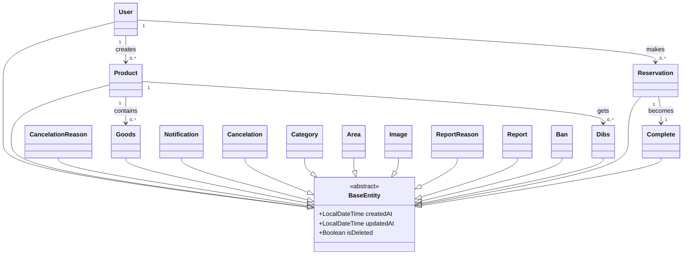

# Entity 설계서

## 문서 정보

- **프로젝트명**: [루키장터]
- **작성자**: [1조/오유식]
- **작성일**: [2025-05-28]
- **버전**: [v1.2]
- **검토자**: [오유식]
- **승인자**: [지재현]

---

## 1. Entity 설계 개요

### 1.1 설계 목적

> JPA Entity 클래스 설계를 통해 객체-관계 매핑(ORM)을 정의하고,
> 비즈니스 도메인을 코드로 표현하여 유지보수가 용이한 시스템을 구축

### 1.2 설계 원칙

- **단일 책임 원칙**: 하나의 Entity는 하나의 비즈니스 개념만 표현
- **캡슐화**: 비즈니스 로직을 Entity 내부에 구현
- **불변성**: 가능한 한 불변 객체로 설계
- **연관관계 최소화**: 필요한 관계만 매핑하여 복잡도 감소

### 1.3 기술 스택

- **ORM 프레임워크**: Spring Data JPA 2.7.x
- **데이터베이스**: MariaDB 11.4
- **검증 프레임워크**: Bean Validation 2.0
- **감사 기능**: Spring Data JPA Auditing

---

## 2. Entity 목록 및 분류

### 2.1 Entity 분류 매트릭스

| Entity명              | 유형 | 비즈니스 중요도 | 기술적 복잡도 | 연관관계 수 | 우선순위 |
| --------------------- | ---- | --------------- | ------------- | ----------- | -------- |
| **Reservation**       | 핵심 | 낮음            | 높음          | 3개         | 1순위    |
| **Complete**          | 핵심 | 낮음            | 높음          | 3개         | 1순위    |
| **Goods**             | 지원 | 낮음            | 높음          | 2개         | 1순위    |
| **Product**           | 핵심 | 높음            | 높음          | 8개         | 1순위    |
| **User**              | 핵심 | 중간            | 높음          | 10개        | 1순위    |
| **CancelationReason** | 지원 | 중간            | 중간          | 1개         | 2순위    |
| **Dibs**              | 지원 | 낮음            | 중간          | 2개         | 2순위    |
| **Notification**      | 지원 | 중간            | 중간          | 1개         | 2순위    |
| **Category**          | 지원 | 낮음            | 중간          | 1개         | 2순위    |
| **Cancelation**       | 이력 | 중간            | 높음          | 2개         | 2순위    |
| **Area**              | 이력 | 낮음            | 낮음          | 1개         | 3순위    |
| **Image**             | 이력 | 낮음            | 낮음          | 1개         | 3순위    |
| **ReportReason**      | 지원 | 낮음            | 낮음          | 1개         | 3순위    |
| **Report**            | 이력 | 중간            | 낮음          | 3개         | 3순위    |
| **Ban**               | 이력 | 낮음            | 낮음          | 2개         | 3순위    |

### 2.2 Entity 상속 구조



---

## 3. 공통 설계 규칙

### 3.1 네이밍 규칙

| 구분                | 규칙                   | 예시                          | 비고            |
| ------------------- | ---------------------- | ----------------------------- | --------------- |
| **Entity 클래스명** | PascalCase             | `User`, `ReportReason`        | 단수형 사용     |
| **Table**           | snake_case             | `users`, `report_reasons`     | 복수형 사용     |
| **컬럼명**          | snake_case             | `user_id`, `created_at`       | 언더스코어 구분 |
| **연관관계 필드**   | camelCase              | `memberLoans`, `bookCategory` | 객체 참조명     |
| **boolean 필드**    | is\_명사,형용사,수동형 | `is_admin`, `is_completed`    | 명확한 의미     |
| **Date Time**       | 수동형\_at             | `created_at`, `added_at`      | 명확한 의미     |

### 3.2 공통 어노테이션 규칙

```java
// 기본 Entity 구조
@Entity
@Table(name = "테이블명")
@Getter
@EntityListeners(AuditingEntityListener.class)
@NoArgsConstructor(access = AccessLevel.PROTECTED)
@SuperBuilder // BaseEntity를 상속하지 않을 경우 @Builder
@ToString
@EqualsAndHashCode
public class EntityName extends BaseEntity {
    // 필드 정의
}
```

### 3.3 ID 생성 전략

| Entity           | 전략                                                 | 이유                                            | 예시                                   |
| ---------------- | ---------------------------------------------------- | ----------------------------------------------- | -------------------------------------- |
| **User**         | IDENTITY (Auto Increment, unique 식별)               | 사용자는 고유해야 하며, 성능상 자동 증가가 적합 | user_id: 1, 2, 3...                    |
| **Product**      | IDENTITY (Auto Increment, 순차 증가)                 | 게시글 순서 관리 및 성능 최적화                 | product_id: 1001, 1002, 1003...        |
| **Reservation**  | IDENTITY (Auto Increment, 순차 증가)                 | 예약 순서 관리 및 빠른 조회                     | reservation_id: 2001, 2002...          |
| **Dibs**         | IDENTITY (Auto Increment, 순차 증가)                 | 찜하기 순서 관리                                | dibs_id: 4001, 4002...                 |
| **Complete**     | IDENTITY (Auto Increment, 순차 증가)                 | 완료 거래 순서 관리                             | complete_id: 5001, 5002...             |
| **Notification** | IDENTITY (Auto Increment, 알림 순서)                 | 알림 발생 순서 보장                             | notification_id: 8001, 8002...         |
| **Report**       | IDENTITY (Auto Increment, 신고 순서, unique 식별)    | 신고 접수 순서 및 고유성 보장                   | report_id: 9001, 9002...               |
| **Ban**          | IDENTITY (Auto Increment, unique 식별)               | 제재 이력 고유성 및 순서 관리                   | ban_id: 11001, 11002...                |
| **Cancelation**  | IDENTITY (Auto Increment, 순차 증가)                 | 취소 이력 고유성 관리                           | cancelation_id: 1                      |
| **Category**     | IDENTITY (카테고리 별로 고정된 id 부여, unique 식별) | 카테고리는 미리 정의된 고정값 사용              | category_id: 1(전자기기), 2(의류)...   |
| **Area**         | IDENTITY (지역 별로 고정된 id 부여, unique 식별)     | 지역정보는 행정구역 기준 고정값                 | area_id: 1(서울), 2(부산)...           |
| **ReportReason** | IDENTITY (사유 별로 고정된 id 부여)                  | 신고사유는 미리 정의된 고정 코드값              | reason_id: 1(스팸), 2(욕설)...         |
| **CancelReason** | IDENTITY (사유 별로 고정된 id 부여)                  | 취소사유는 미리 정의된 고정 코드값              | reason_id: 1(단순변심), 2(상품결함)... |

---

## 4. 상세 Entity 설계

### 4.1 Notification Entity

#### 4.1.1 기본 정보

#### 4.1.2 필드 상세 명세

| 필드명             | 데이터 타입 | 컬럼명          | 제약조건          | 설명                  | 비즈니스 규칙                       |
| ------------------ | ----------- | --------------- | ----------------- | --------------------- | ----------------------------------- |
| **notificationId** | Long        | notification_id | NOT NULL, PK      | 알림 고유 식별자      | 시스템에서 자동 생성되는 고유값     |
| **userId**         | Long        | user_id         | NULL, FK          | 알림 수신자 사용자 ID | 반드시 존재하는 사용자여야 함       |
| **entityId**       | Long        | entity_id       | NULL              | 연관된 엔티티의 ID    | 특정 객체와 연관된 알림인 경우 사용 |
| **entityType**     | String      | entity_type     | VARCHAR(10), NULL | 연관된 엔티티 타입    | PRODUCT, COMMENT, USER 등의 값      |

#### 4.1.3 검증 어노테이션

```java
@Size(max = 20, message = "엔티티 타입은 최대 20자까지 가능합니다.")
@Column(name = "entity_type", length = 20)
private String entityType;

@Size(max = 255, message = "메시지는 최대 255자까지 가능합니다.")
@Column(name = "message", length = 255)
private String message;
```

#### 4.1.4 연관관계 매핑

```java
// N:1 - 여러 알림 내역 : 하나의 사용자
@ManyToOne(fetch = FetchType.LAZY)
@JoinColumn(name = "user_id")
private User user;
```

#### 4.1.5 비즈니스 메서드

```java
    // 비즈니스 메서드: 알림을 읽음 상태로 변경
    public void markAsRead() {
        if (!this.isRead) {
            this.isRead = true;
        }
    }
```

### 4.2 Category Entity

#### 4.2.1 기본 정보

#### 4.2.2 필드 상세 명세

| 필드명            | 데이터 타입 | 컬럼명        | 제약조건 | 설명                   | 비즈니스 규칙                                             |
| ----------------- | ----------- | ------------- | -------- | ---------------------- | --------------------------------------------------------- |
| **category_id**   | INT         | category_id   | NOT NULL | 카테고리의 고유 식별자 | 각 카테고리마다 고유한 정수값 할당, NULL 값 허용하지 않음 |
| **category_name** | VARCHAR(20) | category_name | NULL     | 카테고리의 이름        | 최대 20자까지 입력                                        |

#### 4.2.3 검증 어노테이션

```java
@NotBlank(message = "카테고리 이름은 필수입니다.")
@Size(max = 20, message = "카테고리 이름은 최대 20자까지 가능합니다.")
@Column(name = "category_name", length = 20)
private String categoryName;
```

#### 4.2.4 연관관계 매핑

```java
// 1:N - 하나의 카테고리 : 여러 상품
@OneToMany(mappedBy = "category", cascade = CascadeType.ALL, orphanRemoval = true)
private List<Product> products = new ArrayList<>();
```

#### 4.2.5 비즈니스 메서드

```java
    // 비즈니스 메서드: 카테고리 이름 변경
    public void changeCategoryName(String newCategoryName) {
        if (newCategoryName == null || newCategoryName.trim().isEmpty()) {
            throw new BusinessException(ErrorCode.CATEGORY_NAME_EMPTY);
        }
        if (newCategoryName.length() > 20) {
            throw new BusinessException(ErrorCode.CATEGORY_NAME_TOO_LONG);
        }
        this.categoryName = newCategoryName;
    }
```

#### 4.2.6 생성자 및 팩토리 메서드

### 4.3 Reports Entity

#### 4.3.1 기본 정보

#### 4.3.2 필드 상세 명세

| 필드명               | 데이터 타입  | 컬럼명           | 제약조건 | 설명                   | 비즈니스 규칙                                                                                  |
| -------------------- | ------------ | ---------------- | -------- | ---------------------- | ---------------------------------------------------------------------------------------------- |
| **report_id**        | BIGINT       | report_id        | NOT NULL | 신고의 고유 식별자     | 각 신고마다 고유한 정수값 할당 NULL 값 허용하지 않음 Primary Key로 사용 권장                   |
| **report_reason_id** | INT          | report_reason_id | NULL     | 신고사유의 식별자      | 신고사유 테이블과 연결되는 외래키 NULL 값 허용 사전에 정의된 신고사유 중 하나를 선택           |
| **user_id**          | BIGINT       | user_id          | NULL     | 신고한 사용자의 식별자 | 신고자의 고유 식별자 사용자 테이블과 연결되는 외래키 NULL 값 허용                              |
| **target_id**        | BIGINT       | target_id        | NULL     | 신고 대상의 식별자     | 신고 대상(상품, 댓글 등)의 고유 식별자 NULL 값 허용 target_type과 함께 사용하여 신고 대상 특정 |
| **target_type**      | VARCHAR(10)  | target_type      | NULL     | 신고 대상의 유형       | 신고 대상의 종류 구분 (예: PRODUCT, COMMENT, USER 등) 최대 10자까지 입력 가능 NULL 값 허용     |
| **report_detail**    | VARCHAR(255) | report_detail    | NULL     | 신고에 대한 상세 설명  | 신고자가 작성한 추가 설명 최대 255자까지 입력 가능 NULL 값 허용                                |
| **is_processed**     | BOOLEAN      | is_processed     | NULL     | 신고 처리 완료 여부    | true: 처리 완료, false: 미처리 NULL 값 허용 (기본값 false 권장) 관리자의 신고 처리 상태 추적용 |

#### 4.3.3 검증 어노테이션

```java
@Size(max = 10, message = "신고 대상 타입은 최대 20자까지 가능합니다.")
@Column(name = "target_type", length = 20)
private String targetType;

@Size(max = 255, message = "신고 상세는 최대 255자까지 가능합니다.")
@Column(name = "report_detail", length = 255)
private String reportDetail;
```

#### 4.3.4 연관관계 매핑

```java
// N:1 - 여러 신고 내역 : 하나의 신고사유
@ManyToOne(fetch = FetchType.LAZY)
@JoinColumn(name = "report_reason_id")
private ReportReason reportReason;

// N:1 - 여러 신고 내역 : 하나의 사용자(신고자)
@ManyToOne(fetch = FetchType.LAZY)
@JoinColumn(name = "user_id")
private User user;
```

#### 4.3.5 비즈니스 메서드

```java
    // 비즈니스 메서드: 신고 정보 업데이트
    public void updateReportInfo(ReportReason newReportReason, Long newTargetId, String newTargetType, String newReportDetail) {
        if (newReportReason == null) {
            throw new BusinessException(ErrorCode.REPORT_REASON_EMPTY);
        }
        if (newTargetId == null) {
            throw new BusinessException(ErrorCode.REPORT_TARGET_ID_EMPTY);
        }
        if (newTargetType == null || newTargetType.trim().isEmpty()) {
            throw new BusinessException(ErrorCode.REPORT_TARGET_TYPE_EMPTY);
        }
        if (newTargetType.length() > 20) {
            throw new BusinessException(ErrorCode.REPORT_TARGET_TYPE_TOO_LONG);
        }
        if (newReportDetail != null && newReportDetail.length() > 255) {
            throw new BusinessException(ErrorCode.REPORT_REASON_TOO_LONG);
        }

        this.reportReason = newReportReason;
        this.targetId = newTargetId;
        this.targetType = newTargetType;
        this.reportDetail = newReportDetail;
    }

    // 비즈니스 메서드: 신고 처리 상태 변경
    public void markAsProcessed() {
        if (!this.isProcessed) {
            this.isProcessed = true;
        }
    }
```

#### 4.3.6 생성자 및 팩토리 메서드

### 4.4 Dibs Entity

#### 4.4.1 기본 정보

#### 4.4.2 필드 상세 명세

| 필드명         | 데이터 타입 | 컬럼명     | 제약조건 | 설명                 | 비즈니스 규칙                                                                |
| -------------- | ----------- | ---------- | -------- | -------------------- | ---------------------------------------------------------------------------- |
| **dibs_id**    | BIGINT      | dibs_id    | NOT NULL | 찜의 고유 식별자     | 각 찜마다 고유한 정수값 할당, NULL 값 허용하지 않음, Primary Key로 사용 권장 |
| **user_id**    | BIGINT      | user_id    | NULL     | 찜한 사용자의 식별자 | 찜을 한 사용자의 고유 식별자, 사용자 테이블과 연결되는 외래키, NULL 값 허용  |
| **product_id** | BIGINT      | product_id | NULL     | 찜한 상품의 식별자   | 찜 대상 상품의 고유 식별자, 상품 테이블과 연결되는 외래키, NULL 값 허용      |
| **added_at**   | TIMESTAMP   | added_at   | NULL     | 찜이 추가된 일시     | 찜 등록 시점 기록, NULL 값 허용, 자동으로 현재 시간 설정 권장                |

#### 4.4.3 검증 어노테이션

#### 4.4.4 연관관계 매핑

```java
// N:1 - 여러 찜 : 하나의 사용자
@ManyToOne(fetch = FetchType.LAZY)
@JoinColumn(name = "user_id")
private User user;

// N:1 - 여러 찜 : 하나의 상품
@ManyToOne(fetch = FetchType.LAZY)
@JoinColumn(name = "product_id")
private Product product;
```

#### 4.4.5 비즈니스 메서드

```java
    // 비즈니스 메서드: 상품 정보 업데이트
    public void updateProductInfo(Category newCategory, String newTitle, String newContent, Integer newPrice) {
        if (newCategory == null) {
            throw new BusinessException(ErrorCode.CATEGORY_NOT_FOUND, "카테고리 정보가 필요합니다.");
        }
        if (newTitle == null || newTitle.trim().isEmpty()) {
            throw new BusinessException(ErrorCode.PRODUCT_NAME_EMPTY);
        }
        if (newTitle.length() > 50) {
            throw new BusinessException(ErrorCode.PRODUCT_NAME_TOO_LONG);
        }
        if (newContent == null || newContent.trim().isEmpty()) {
            throw new BusinessException(ErrorCode.PRODUCT_CONTENT_EMPTY);
        }
        if (newContent.length() > 255) {
            throw new BusinessException(ErrorCode.PRODUCT_CONTENT_TOO_LONG);
        }
        if (newPrice == null || newPrice < 0) { // 가격은 0 이상이어야 함
            throw new BusinessException(ErrorCode.PRODUCT_PRICE_NEGATIVE);
        }

        this.category = newCategory;
        this.title = newTitle;
        this.content = newContent;
        this.price = newPrice;
    }

    // 비즈니스 메서드: 조회수 증가
    public void incrementViewCount() {
        if (this.viewCount == null) {
            this.viewCount = 0;
        }
        this.viewCount++;
    }

    // 비즈니스 메서드: 끌어올리기 상태 변경
    public void markAsBumped(boolean isBumped) {
        this.isBumped = isBumped;
    }

    // 비즈니스 메서드: 예약 상태 변경
    public void markAsReserved(boolean isReserved) {
        this.isReserved = isReserved;
    }

    // 비즈니스 메서드: 거래 완료 상태 변경
    public void markAsCompleted(boolean isCompleted) {
        this.isCompleted = isCompleted;
    }
```

#### 4.4.6 생성자 및 팩토리 메서드

### 4.5 Reservations Entity

#### 4.5.1 기본 정보

#### 4.5.2 필드 상세 명세

| 필드명             | 데이터 타입 | 컬럼명         | 제약조건 | 설명                 | 비즈니스 규칙                                                                       |
| ------------------ | ----------- | -------------- | -------- | -------------------- | ----------------------------------------------------------------------------------- |
| **reservation_id** | BIGINT      | reservation_id | NOT NULL | 예약의 고유 식별자   | 각 예약마다 고유한 정수값 할당, NULL 값 허용하지 않음, Primary Key로 사용 권장      |
| **buyer_id**       | BIGINT      | buyer_id       | NULL     | 구매자의 식별자      | 상품을 예약한 구매자의 고유 식별자, 사용자 테이블과 연결되는 외래키, NULL 값 허용   |
| **seller_id**      | BIGINT      | seller_id      | NULL     | 판매자의 식별자      | 상품을 판매하는 판매자의 고유 식별자, 사용자 테이블과 연결되는 외래키, NULL 값 허용 |
| **product_id**     | BIGINT      | product_id     | NULL     | 예약된 상품의 식별자 | 예약 대상 상품의 고유 식별자, 상품 테이블과 연결되는 외래키, NULL 값 허용           |
| **status**         | ENUM        | status         | NULL     | 예약 상태 식별       | 예약 상태 구분을 위한 문자열 포함                                                   |

#### 4.5.3 검증 어노테이션

#### 4.5.4 연관관계 매핑

```java
// N:1 - 여러 거래 예약 정보 : 하나의 사용자(구매자)
@ManyToOne(fetch = FetchType.LAZY)
@JoinColumn(name = "buyer_id")
private User buyer;

// N:1 - 여러 거래 예약 정보 : 하나의 사용자(판매자)
@ManyToOne(fetch = FetchType.LAZY)
@JoinColumn(name = "seller_id")
private User seller;

// N:1 - 여러 거래 예약 정보 : 하나의 상품 (취소된 예약 포함, 실질적으로는 1:1)
@ManyToOne(fetch = FetchType.LAZY)
@JoinColumn(name = "product_id")
private Product product;
```

#### 4.5.5 비즈니스 메서드

```java
    // 비즈니스 메서드: 예약 상태를 요청됨으로 변경
    public void requestReservation() {
        if (this.status != null && this.status != TradeStatus.REQUESTED) {
            throw new BusinessException(ErrorCode.RESERVATION_ALREADY_EXISTS, this.product.getProductId());
        }
        this.status = TradeStatus.REQUESTED;
        this.isCanceled = false;
    }

    // 비즈니스 메서드: 예약 상태를 수락됨으로 변경
    public void acceptReservation() {
        if (this.status != TradeStatus.REQUESTED) {
            throw new BusinessException(ErrorCode.RESERVATION_INVALID_STATE_FOR_ACTION, this.status, "수락");
        }
        this.status = TradeStatus.ACCEPTED;
        this.isCanceled = false;
    }

    // 비즈니스 메서드: 예약 상태를 거절됨으로 변경
    public void declineReservation() {
        if (this.status != TradeStatus.REQUESTED) {
            throw new BusinessException(ErrorCode.RESERVATION_INVALID_STATE_FOR_ACTION, this.status, "거절");
        }
        this.status = TradeStatus.DECLINED;
        this.isCanceled = true; // 거절 시에는 예약이 취소됨
    }

    // 비즈니스 메서드: 예약을 취소
    public void cancelReservation() {
        if (this.status == TradeStatus.COMPLETED) {
            throw new BusinessException(ErrorCode.RESERVATION_CANNOT_CANCEL, this.status);
        }
        if (this.isCanceled) {
            throw new BusinessException(ErrorCode.RESERVATION_CANNOT_CANCEL, this.status);
        }
        this.status = TradeStatus.CANCELLED;
        this.isCanceled = true;
    }

    // 비즈니스 메서드: 예약을 완료됨 상태로 변경 (거래가 성사되었을 때)
    public void completeReservation() {
        if (this.status != TradeStatus.ACCEPTED) {
            throw new BusinessException(ErrorCode.RESERVATION_INVALID_STATE_FOR_ACTION, this.status, "완료");
        }
        this.status = TradeStatus.COMPLETED;
        this.isCanceled = false;
    }
```

#### 4.5.6 생성자 및 팩토리 메서드

### 4.7 Images Entity

#### 4.7.1 기본 정보

#### 4.7.2 필드 상세 명세

| 필드명         | 데이터 타입  | 컬럼명     | 제약조건 | 설명                        | 비즈니스 규칙                                                                                              |
| -------------- | ------------ | ---------- | -------- | --------------------------- | ---------------------------------------------------------------------------------------------------------- |
| **image_id**   | BIGINT       | image_id   | NOT NULL | 이미지의 고유 식별자        | 기본키로 사용, 자동 증가 값 권장, 중복 불가                                                                |
| **product_id** | BIGINT       | product_id | NULL     | 이미지가 속한 상품의 식별자 | 외래키로 사용, products 테이블의 product_id 참조                                                           |
| **image_url**  | VARCHAR(255) | image_url  | NOT NULL | 이미지 파일의 URL 경로      | 최대 255자까지 입력 가능, 유효한 URL 형식이어야 함, 절대 경로 또는 상대 경로 허용, 빈 문자열 허용하지 않음 |

#### 4.7.3 검증 어노테이션

```java
@NotBlank(message = "이미지 URL은 필수입니다.")
@Size(max = 255, message = "이미지 URL은 최대 255자까지 가능합니다.")
@Column(name = "image_url", length = 255, nullable = false)
private String imageUrl;
```

#### 4.7.4 연관관계 매핑

```java
// N:1 - 여러 이미지 : 하나의 상품
@ManyToOne(fetch = FetchType.LAZY)
@JoinColumn(name = "product_id")
private Product product;
```

#### 4.7.5 비즈니스 메서드

#### 4.7.6 생성자 및 팩토리 메서드

### 4.8 Users Entity

#### 4.8.1 기본 정보

#### 4.8.2 필드 상세 명세

| 필드명        | 데이터 타입 | 컬럼명    | 제약조건 | 설명                        | 비즈니스 규칙                                                                                             |
| ------------- | ----------- | --------- | -------- | --------------------------- | --------------------------------------------------------------------------------------------------------- |
| **user_id**   | BIGINT      | user_id   | NOT NULL | 사용자의 고유 식별자        | 기본키로 사용, 자동 증가 값 권장, 중복 불가                                                               |
| **area_id**   | INT         | area_id   | NOT NULL | 사용자가 속한 지역의 식별자 | 외래키로 사용, areas 테이블의 area_id 참조, 필수 입력 값                                                  |
| **login_id**  | VARCHAR(20) | login_id  | NOT NULL | 로그인용 사용자 아이디      | 최대 20자까지 입력 가능, 영문, 숫자 조합 권장, 중복 불가 (UNIQUE 제약조건 필요), 빈 문자열 허용하지 않음  |
| **password**  | VARCHAR(20) | password  | NOT NULL | 사용자 비밀번호             | 최대 20자까지 입력 가능, 암호화하여 저장 권장, 특수문자 포함 권장, 빈 문자열 허용하지 않음                |
| **user_name** | VARCHAR(12) | user_name | NOT NULL | 사용자 실명 또는 닉네임     | 최대 12자까지 입력 가능, 한글, 영문 모두 허용, 빈 문자열 허용하지 않음                                    |
| **phone**     | VARCHAR(20) | phone     | NOT NULL | 사용자 전화번호             | 최대 20자까지 입력 가능, 숫자와 하이픈(-) 허용, 중복 불가 (UNIQUE 제약조건 권장), 빈 문자열 허용하지 않음 |
| **is_banned** | BOOLEAN     | is_banned | NULL     | 사용자 차단 여부            | 기본값: FALSE, TRUE: 차단됨, FALSE: 정상, NULL: 차단 상태 미확인                                          |
| **is_admin**  | BOOLEAN     | is_admin  | NULL     | 관리자 권한 여부            | 기본값: FALSE, TRUE: 관리자, FALSE: 일반 사용자, NULL: 권한 상태 미확인                                   |

#### 4.8.3 검증 어노테이션

```java
@NotBlank(message = "로그인 ID는 필수입니다.")
@Size(min = 4, max = 20, message = "로그인 ID는 4~20자 이내로 입력해야 합니다.")
@Pattern(regexp = "^[a-zA-Z0-9]+$", message = "로그인 ID는 영문과 숫자 조합만 가능합니다.")
@Column(name = "login_id", length = 20, nullable = false, unique = true)
private String loginId;

@NotBlank(message = "비밀번호는 필수입니다.")
@Size(min = 8, max = 20, message = "비밀번호는 8~20자 이내로 입력해야 합니다.")
@Pattern(regexp = "^(?=.*[a-zA-Z])(?=.*[0-9])(?=.*[@#$%^&+=!]).*$", message = "비밀번호는 영문, 숫자, 특수문자를 각 1개 이상 포함해야 합니다.")
@Column(name = "password", length = 20, nullable = false)
private String password;

@NotBlank(message = "이름은 필수입니다.")
@Size(min = 2, max = 12, message = "이름은 2~12자 이내로 입력해야 합니다.")
@Pattern(regexp = "^[가-힣a-zA-Z]+$", message = "이름은 한글과 영문만 가능합니다.")
@Column(name = "user_name", length = 12, nullable = false)
private String userName;

@NotBlank(message = "전화번호는 필수입니다.")
@Size(min = 9, max = 20, message = "유효한 전화번호를 입력해야 합니다.")
@Pattern(regexp = "^010-\\d{4}-\\d{4}$", message = "전화번호 형식은 010-XXXX-XXXX 입니다.")
@Column(name = "phone", length = 20, nullable = false, unique = true)
private String phone;
```

#### 4.8.4 연관관계 매핑

```java
// N:1 - 여러 사용자 : 하나의 지역
@ManyToOne(fetch = FetchType.LAZY)
@JoinColumn(name = "area_id")
private Area area;

// 1:N 하나의 사용자 : 여러 상품
@OneToMany(mappedBy = "user", cascade = CascadeType.ALL, orphanRemoval = true)
private List<Product> products = new ArrayList<>();

// 1:N 하나의 사용자 : 여러 신고 내역
@OneToMany(mappedBy = "user", cascade = CascadeType.ALL, orphanRemoval = true)
private List<Report> reports = new ArrayList<>();

// 1:N 하나의 사용자 : 여러 (구매자로서 작성한) 리뷰
@OneToMany(mappedBy = "buyer", cascade = CascadeType.ALL, orphanRemoval = true)
private List<Review> buyerReviews = new ArrayList<>();

// 1:N 하나의 사용자 : 여러 (판매자로서 작성된) 리뷰
@OneToMany(mappedBy = "seller", cascade = CascadeType.ALL, orphanRemoval = true)
private List<Review> sellerReviews = new ArrayList<>();

// 1:N 하나의 사용자 : 여러 거래 예약 정보 (구매자로서)
@OneToMany(mappedBy = "buyer", cascade = CascadeType.ALL, orphanRemoval = true)
private List<Reservation> buyerReservations = new ArrayList<>();

// 1:N 하나의 사용자 : 여러 거래 예약 정보 (판매자로서)
@OneToMany(mappedBy = "seller", cascade = CascadeType.ALL, orphanRemoval = true)
private List<Reservation> sellerReservations = new ArrayList<>();

// 1:N 하나의 사용자 : 여러 채팅 (구매자로서)
@OneToMany(mappedBy = "buyer", cascade = CascadeType.ALL, orphanRemoval = true)
private List<Chat> buyerChats = new ArrayList<>();

// 1:N 하나의 사용자 : 여러 채팅 (판매자로서)
@OneToMany(mappedBy = "seller", cascade = CascadeType.ALL, orphanRemoval = true)
private List<Chat> sellerChats = new ArrayList<>();

// 1:N 하나의 사용자 : 여러 찜
@OneToMany(mappedBy = "user", cascade = CascadeType.ALL, orphanRemoval = true)
private List<Dibs> dibsList = new ArrayList<>();

// 1:N 하나의 사용자 : 여러 알림 내역
@OneToMany(mappedBy = "user", cascade = CascadeType.ALL, orphanRemoval = true)
private List<Notification> notifications = new ArrayList<>();

// 1:N 하나의 사용자 : 여러 제재 내역
@OneToMany(mappedBy = "user", cascade = CascadeType.ALL, orphanRemoval = true)
private List<Ban> bans = new ArrayList<>();

// 1:N 하나의 사용자 :여러 거래 완료 (구매자로서)
@OneToMany(mappedBy = "buyer", cascade = CascadeType.ALL, orphanRemoval = true)
private List<Complete> buyerCompletes = new ArrayList<>();

// 1:N 하나의 사용자 : 여러 거래 완료 (판매자로서)
@OneToMany(mappedBy = "seller", cascade = CascadeType.ALL, orphanRemoval = true)
private List<Complete> sellerCompletes = new ArrayList<>();
```

#### 4.8.5 비즈니스 메서드

```java
    // 비즈니스 메서드: 사용자 정보 업데이트
    public void updateUserInfo(Area newArea, String newUserName, String newPhone) {
        if (newArea == null) {
            throw new BusinessException(ErrorCode.INVALID_AREA);
        }
        if (newUserName.length() > 12) {
            throw new BusinessException(ErrorCode.USERNAME_TOO_LONG);
        }
        if (newPhone.length() > 20) {
            throw new BusinessException(ErrorCode.PHONE_TOO_LONG);
        }

        this.area = newArea;
        this.userName = newUserName;
        this.phone = newPhone;
    }

    // 비즈니스 메서드: 사용자 제재 상태 변경
    public void changeBanStatus(boolean isBanned) {
        this.isBanned = isBanned;
    }

    // 비즈니스 메서드: 관리자 권한 변경
    public void changeAdminStatus(boolean isAdmin) {
        this.isAdmin = isAdmin;
    }
```

#### 4.8.6 생성자 및 팩토리 메서드

### 4.9 Bans Entity

#### 4.9.1 기본 정보

#### 4.9.2 필드 상세 명세

| 필드명         | 데이터 타입 | 컬럼명     | 제약조건 | 설명                         | 비즈니스 규칙                                                                              |
| -------------- | ----------- | ---------- | -------- | ---------------------------- | ------------------------------------------------------------------------------------------ |
| **ban_id**     | BIGINT      | ban_id     | NOT NULL | 차단의 고유 식별자           | 기본키로 사용, 자동 증가 값 권장, 중복 불가                                                |
| **user_id**    | BIGINT      | user_id    | NULL     | 차단된 사용자의 식별자       | 외래키로 사용, users 테이블의 user_id 참조                                                 |
| **report_id**  | BIGINT      | report_id  | NULL     | 차단 근거가 된 신고의 식별자 | 외래키로 사용, reports 테이블의 report_id 참조                                             |
| **ban_reason** | VARCHAR(50) | ban_reason | NULL     | 차단 사유 설명               | 최대 50자까지 입력 가능, NULL 허용 (기본 차단 사유 적용), 관리자가 직접 입력하는 상세 사유 |

#### 4.9.3 검증 어노테이션

```java
@Size(max = 50, message = "제재 사유는 최대 50자까지 가능합니다.")
@Column(name = "ban_reason", length = 50)
private String banReason;
```

#### 4.9.4 연관관계 매핑

```java
// N:1 - 여러 제재 내역 : 하나의 사용자
@ManyToOne(fetch = FetchType.LAZY)
@JoinColumn(name = "user_id")
private User user;

// N:1 - 여러 제재 내역 : 하나의 신고
@ManyToOne(fetch = FetchType.LAZY)
@JoinColumn(name = "report_id")
private Report report;
```

#### 4.9.5 비즈니스 메서드

#### 4.9.6 생성자 및 팩토리 메서드

### 4.10 areas Entity

#### 4.10.1 기본 정보

#### 4.10.2 필드 상세 명세

| 필드명        | 데이터 타입 | 컬럼명    | 제약조건 | 설명               | 비즈니스 규칙                                                                                        |
| ------------- | ----------- | --------- | -------- | ------------------ | ---------------------------------------------------------------------------------------------------- |
| **area_id**   | INT         | area_id   | NOT NULL | 지역의 고유 식별자 | 기본키로 사용, 자동 증가 값 권장, 중복 불가                                                          |
| **area_name** | VARCHAR(50) | area_name | NULL     | 지역명             | 최대 50자까지 입력 가능, NULL 허용 (미분류 지역의 경우), 예: '서울특별시', '부산광역시', '경기도' 등 |

#### 4.10.3 검증 어노테이션

```java
@NotBlank(message = "지역 이름은 필수입니다.")
@Size(max = 50, message = "지역 이름은 최대 50자까지 가능합니다.")
@Column(name = "area_name", length = 50)
private String areaName;
```

#### 4.10.4 연관관계 매핑

```java
// 1:N 하나의 지역: 여러 사용자
@OneToMany(mappedBy = "area", cascade = CascadeType.ALL, orphanRemoval = true)
private List<User> users = new ArrayList<>();
```

#### 4.10.5 비즈니스 메서드

```java
    // 비즈니스 메서드: 지역 이름 변경
    public void changeAreaName(String newAreaName) {
        if (newAreaName == null || newAreaName.trim().isEmpty()) {
            throw new BusinessException(ErrorCode.AREA_NAME_EMPTY);
        }
        if (newAreaName.length() > 50) {
            throw new BusinessException(ErrorCode.AREA_NAME_TOO_LONG);
        }
        this.areaName = newAreaName;
    }
```

#### 4.10.6 생성자 및 팩토리 메서드

### 4.11 Products Entity

#### 4.11.1 기본 정보

#### 4.11.2 필드 상세 명세

| 필드명           | 데이터 타입  | 컬럼명       | 제약조건 | 설명                          | 비즈니스 규칙                                                                        |
| ---------------- | ------------ | ------------ | -------- | ----------------------------- | ------------------------------------------------------------------------------------ |
| **product_id**   | BIGINT       | product_id   | NOT NULL | 상품의 고유 식별자            | 기본키로 사용, 자동 증가 값 권장, 중복 불가                                          |
| **category_id**  | INT          | category_id  | NULL     | 상품이 속한 카테고리의 식별자 | 외래키로 사용, categories 테이블의 category_id 참조                                  |
| **user_id**      | BIGINT       | user_id      | NULL     | 상품 작성자의 식별자          | 외래키로 사용, users 테이블의 user_id 참조, NULL 허용 (익명 상품 또는 탈퇴한 사용자) |
| **title**        | VARCHAR(50)  | title        | NOT NULL | 상품 제목                     | 최대 50자까지 입력 가능, 빈 문자열 허용하지 않음, 특수문자 포함 가능                 |
| **content**      | VARCHAR(255) | content      | NOT NULL | 상품 내용                     | 최대 255자까지 입력 가능, 빈 문자열 허용하지 않음, 특수문자, 줄바꿈 포함 가능        |
| **price**        | INT          | price        | NULL     | 상품 상품 가격                | 원 단위로 저장, 음수 값 허용하지 않음, NULL 허용 (가격 협의 또는 무료 나눔)          |
| **view_count**   | INT          | view_count   | NULL     | 상품 조회수                   | 기본값: 0, 음수 값 허용하지 않음, NULL 허용 (조회수 미집계 상태)                     |
| **is_bumped**    | BOOLEAN      | is_bumped    | NULL     | 상품 끌어올리기 여부          | 기본값: FALSE, TRUE: 끌어올림, FALSE: 일반, NULL: 끌어올리기 상태 미확인             |
| **is_reserved**  | BOOLEAN      | is_reserved  | NULL     | 상품 예약 여부                | 기본값: FALSE, TRUE: 예약됨, FALSE: 예약 안됨, NULL: 예약 상태 미확인                |
| **is_completed** | BOOLEAN      | is_completed | NULL     | 상품 완료 여부                | 기본값: FALSE, TRUE: 완료됨, FALSE: 진행중, NULL: 완료 상태 미확인                   |

#### 4.11.3 검증 어노테이션

```java
@NotBlank(message = "제목은 필수입니다.")
@Size(max = 50, message = "제목은 최대 50자까지 가능합니다.")
@Column(name = "title", length = 50, nullable = false)
private String title;

@NotBlank(message = "내용은 필수입니다.")
@Size(max = 255, message = "내용은 최대 255자까지 가능합니다.")
@Column(name = "content", length = 255, nullable = false)
private String content;

@NotNull(message = "가격은 필수입니다.")
@Column(name = "price", nullable = false)
private Integer price;

@NotNull(message = "카테고리 ID는 필수입니다.")
@ManyToOne(fetch = FetchType.LAZY)
@JoinColumn(name = "category_id")
private Category category;
```

#### 4.11.4 연관관계 매핑

```java
// N:1 - 여러 상품 : 하나의 카테고리
@ManyToOne(fetch = FetchType.LAZY)
@JoinColumn(name = "category_id")
private Category category;

// N:1 - 여러 상품 : 하나의 사용자
@ManyToOne(fetch = FetchType.LAZY)
@JoinColumn(name = "user_id")
private User user;
```

#### 4.11.5 비즈니스 메서드

```java
    // 비즈니스 메서드: 상품 정보 업데이트
    public void updateProductInfo(Category newCategory, String newTitle, String newContent, Integer newPrice) {
        if (newCategory == null) {
            throw new BusinessException(ErrorCode.CATEGORY_NOT_FOUND, "카테고리 정보가 필요합니다.");
        }
        if (newTitle == null || newTitle.trim().isEmpty()) {
            throw new BusinessException(ErrorCode.PRODUCT_NAME_EMPTY);
        }
        if (newTitle.length() > 50) {
            throw new BusinessException(ErrorCode.PRODUCT_NAME_TOO_LONG);
        }
        if (newContent == null || newContent.trim().isEmpty()) {
            throw new BusinessException(ErrorCode.PRODUCT_CONTENT_EMPTY);
        }
        if (newContent.length() > 255) {
            throw new BusinessException(ErrorCode.PRODUCT_CONTENT_TOO_LONG);
        }
        if (newPrice == null || newPrice < 0) { // 가격은 0 이상이어야 함
            throw new BusinessException(ErrorCode.PRODUCT_PRICE_NEGATIVE);
        }

        this.category = newCategory;
        this.title = newTitle;
        this.content = newContent;
        this.price = newPrice;
    }

    // 비즈니스 메서드: 조회수 증가
    public void incrementViewCount() {
        if (this.viewCount == null) {
            this.viewCount = 0;
        }
        this.viewCount++;
    }

    // 비즈니스 메서드: 끌어올리기 상태 변경
    public void markAsBumped(boolean isBumped) {
        this.isBumped = isBumped;
    }

    // 비즈니스 메서드: 예약 상태 변경
    public void markAsReserved(boolean isReserved) {
        this.isReserved = isReserved;
    }

    // 비즈니스 메서드: 거래 완료 상태 변경
    public void markAsCompleted(boolean isCompleted) {
        this.isCompleted = isCompleted;
    }
```

#### 4.11.6 생성자 및 팩토리 메서드

### 4.12 Completes Entity

#### 4.12.1 기본 정보

#### 4.12.2 필드 상세 명세

| 필드명           | 데이터 타입 | 컬럼명       | 제약조건 | 설명                      | 비즈니스 규칙                                                                                   |
| ---------------- | ----------- | ------------ | -------- | ------------------------- | ----------------------------------------------------------------------------------------------- |
| **complete_id**  | BIGINT      | complete_id  | NOT NULL | 완료된 거래의 고유 식별자 | 기본키로 사용, 자동 증가 값 권장, 중복 불가                                                     |
| **product_id**   | BIGINT      | product_id   | NULL     | 거래 완료된 상품의 식별자 | 외래키로 사용, products 테이블의 product_id 참조, NULL 허용 (상품 삭제된 경우)                  |
| **buyer_id**     | BIGINT      | buyer_id     | NULL     | 구매자의 식별자           | 외래키로 사용, users 테이블의 user_id 참조, NULL 허용 (익명 거래 또는 탈퇴한 사용자)            |
| **seller_id**    | BIGINT      | seller_id    | NULL     | 판매자의 식별자           | 외래키로 사용, users 테이블의 user_id 참조, NULL 허용 (익명 거래 또는 탈퇴한 사용자)            |
| **completed_at** | TIMESTAMP   | completed_at | NULL     | 거래 완료 시각            | 거래 완료 시 자동으로 현재 시간 설정 권장, NULL 허용 (완료 시간 미기록), UTC 기준으로 저장 권장 |

#### 4.12.3 검증 어노테이션

#### 4.12.4 연관관계 매핑

```java
// 1:1 - 하나의 거래 완료 : 하나의 상품
@OneToOne(fetch = FetchType.LAZY)
@JoinColumn(name = "product_id")
private Product product;

// N:1 - 하나의 거래 완료 : 하나의 사용자(구매자)
@ManyToOne(fetch = FetchType.LAZY)
@JoinColumn(name = "buyer_id")
private User buyer;

// N:1 - 하나의 거래 완료 : 하나의 사용자(판매자)
@ManyToOne(fetch = FetchType.LAZY)
@JoinColumn(name = "seller_id")
private User seller;
```

#### 4.12.5 비즈니스 메서드

#### 4.12.6 생성자 및 팩토리 메서드

### 4.13 Cancelations Entity

#### 4.13.1 기본 정보

#### 4.13.2 필드 상세 명세

| 필드명                    | 데이터 타입  | 컬럼명                | 제약조건 | 설명                 | 비즈니스 규칙                                                                                   |
| ------------------------- | ------------ | --------------------- | -------- | -------------------- | ----------------------------------------------------------------------------------------------- |
| **cancelation_id**        | BIGINT       | reservation_id        | NOT NULL | 취소 식별자          | 기본키로 사용, 중복 불가                                                                        |
| **reservation_id**        | BIGINT       | reservation_id        | NULL     | 취소된 예약의 식별자 | 외래키로 사용, reservations 테이블의 reservation_id 참조, 중복 불가                             |
| **cancelation_reason_id** | INT          | cancelation_reason_id | NULL     | 취소사유의 식별자    | 외래키로 사용, cancelation_reasons 테이블의 cancelation_reason_id 참조                          |
| **canceler_id**           | BIGINT       | canceler_id           | NULL     | 취소사유의 식별자    | 외래키로 사용, cancelation_reasons 테이블의 user_id 참조                                        |
| **report_detail**         | VARCHAR(255) | report_detail         | NULL     | 취소 상세 내용       | 최대 255자까지 입력 가능, NULL 허용 (기본 취소사유만 적용), 사용자가 직접 입력하는 상세 사유    |
| **canceled_at**           | TIMESTAMP    | canceled_at           | NULL     | 취소 처리 시각       | 취소 처리 시 자동으로 현재 시간 설정 권장, NULL 허용 (취소 시간 미기록), UTC 기준으로 저장 권장 |

#### 4.13.3 검증 어노테이션

```java
@Size(max = 255, message = "취소 상세는 최대 255자까지 가능합니다.")
private String cancelationDetail;
```

#### 4.13.4 연관관계 매핑

```java
// 1:1 - 하나의 거래 취소 : 하나의 거래 예약
@OneToOne(fetch = FetchType.LAZY)
@JoinColumn(name = "reservation_id")
private Reservation reservation;

// N:1 - 여러 거래 취소 : 하나의 취소사유
@ManyToOne(fetch = FetchType.LAZY)
@JoinColumn(name = "cancelation_reason_id")
private CancelationReason cancelationReason;
```

#### 4.13.5 비즈니스 메서드

```java
    // 비즈니스 메서드: 취소 정보 업데이트
    public void updateCancelationInfo(CancelationReason newCancelationReason, String newCancelationDetail) {
        if (newCancelationReason == null) {
            throw new BusinessException(ErrorCode.CANCELATION_REASON_EMPTY);
        }
        if (newCancelationDetail != null && newCancelationDetail.length() > 255) {
            throw new BusinessException(ErrorCode.CANCELATION_REASON_TOO_LONG);
        }

        this.cancelationReason = newCancelationReason;
        this.cancelationDetail = newCancelationDetail;
    }
```

#### 4.13.6 생성자 및 팩토리 메서드

### 4.14 Cancelation_reasons Entity

#### 4.14.1 기본 정보

#### 4.14.2 필드 상세 명세

| 필드명                      | 데이터 타입 | 컬럼명                  | 제약조건 | 설명                   | 비즈니스 규칙                                                                                         |
| --------------------------- | ----------- | ----------------------- | -------- | ---------------------- | ----------------------------------------------------------------------------------------------------- |
| **cancelation_reason_id**   | INT         | cancelation_reason_id   | NOT NULL | 취소사유의 고유 식별자 | 기본키로 사용, 자동 증가 값 권장, 중복 불가                                                           |
| **cancelation_reason_type** | VARCHAR(50) | cancelation_reason_type | NULL     | 취소사유 유형          | 최대 50자까지 입력 가능, NULL 허용 (기타 사유의 경우), 예: '단순 변심', '상품 불만족', '일정 변경' 등 |

#### 4.14.3 검증 어노테이션

```java
@Size(max = 50, message = "취소사유 타입은 최대 50자까지 가능합니다.")
@Column(name = "cancelation_reason_type", length = 50)
private String cancelationReasonType;
```

#### 4.14.4 연관관계 매핑

#### 4.14.5 비즈니스 메서드

```java
    // 비즈니스 메서드: 취소 사유 유형 내용 변경
    public void changeReasonType(String newReasonType) {
        if (newReasonType == null || newReasonType.trim().isEmpty()) {
            throw new BusinessException(ErrorCode.CANCELATION_REASON_EMPTY);
        }
        if (newReasonType.length() > 50) {
            throw new BusinessException(ErrorCode.CANCELATION_REASON_TOO_LONG);
        }
        this.cancelationReasonType = newReasonType;
    }
```

#### 4.14.6 생성자 및 팩토리 메서드

### 4.17 Report_reasons Entity

#### 4.17.1 기본 정보

#### 4.17.2 필드 상세 명세

| 필드명                 | 데이터 타입 | 컬럼명             | 제약조건 | 설명                   | 비즈니스 규칙                                                                                 |
| ---------------------- | ----------- | ------------------ | -------- | ---------------------- | --------------------------------------------------------------------------------------------- |
| **report_reason_id**   | INT         | report_reason_id   | NOT NULL | 신고사유의 고유 식별자 | 기본키로 사용, 자동 증가 값 권장, 중복 불가                                                   |
| **report_reason_type** | VARCHAR(50) | report_reason_type | NULL     | 신고사유 유형          | 최대 50자까지 입력 가능, NULL 허용 (기타 사유의 경우), 예: '스팸', '욕설', '부적절한 내용' 등 |

#### 4.17.3 검증 어노테이션

```java
@Size(max = 50, message = "신고사유 타입은 최대 50자까지 가능합니다.")
@Column(name = "report_reason_type", length = 50)
private String reportReasonType;
```

#### 4.17.4 연관관계 매핑

```java
// N:1 - 여러 신고 내역 : 하나의 신고사유
@OneToMany(mappedBy = "reportReason", cascade = CascadeType.ALL, orphanRemoval = true)
private List<Report> reports = new ArrayList<>();
```

#### 4.17.5 비즈니스 메서드

```java
    // 비즈니스 메서드: 신고 사유 유형 내용 변경
    public void changeReasonType(String newReasonType) {
        if (newReasonType == null || newReasonType.trim().isEmpty()) {
            throw new BusinessException(ErrorCode.REPORT_REASON_EMPTY);
        }
        if (newReasonType.length() > 50) {
            throw new BusinessException(ErrorCode.REPORT_REASON_TOO_LONG);
        }
        this.reportReasonType = newReasonType;
    }
```

#### 4.17.6 생성자 및 팩토리 메서드

## 5. Enum 타입 정의

---

## 6. 연관관계 매핑 전략

### 6.1 연관관계 매핑 규칙

| 관계 유형       | 기본 전략 | 이유          | 예외 상황                     |
| --------------- | --------- | ------------- | ----------------------------- |
| **@ManyToOne**  | LAZY      | 성능 최적화   | 필수 조회 데이터는 EAGER      |
| **@OneToMany**  | LAZY      | N+1 문제 방지 | 소량 데이터는 EAGER           |
| **@OneToOne**   | LAZY      | 일관성 유지   | 항상 함께 조회하는 경우 EAGER |
| **@ManyToMany** | 사용 금지 | 복잡성 증가   | 중간 테이블로 대체            |

### 6.2 Cascade 옵션 가이드

```java
// 부모-자식 관계 (강한 연결)
@OneToMany(mappedBy = "member", cascade = CascadeType.ALL, orphanRemoval = true)
private List<Loan> loans = new ArrayList<>();

// 참조 관계 (약한 연결)
@ManyToOne(fetch = FetchType.LAZY)
@JoinColumn(name = "category_id")
private Category category; // cascade 없음

// 선택적 관계
@OneToMany(mappedBy = "book", cascade = {CascadeType.PERSIST, CascadeType.MERGE})
private List<Reservation> reservations = new ArrayList<>();
```

### 6.3 양방향 연관관계 관리

```java
// Member Entity에서
public void addLoan(Loan loan) {
    loans.add(loan);
    loan.setMember(this); // 양방향 연관관계 동기화
}

public void removeLoan(Loan loan) {
    loans.remove(loan);
    loan.setMember(null);
}

// Loan Entity에서
public void setMember(Member member) {
    // 기존 관계 제거
    if (this.member != null) {
        this.member.getLoans().remove(this);
    }

    this.member = member;

    // 새로운 관계 설정
    if (member != null && !member.getLoans().contains(this)) {
        member.getLoans().add(this);
    }
}
```

---

## 7. 감사(Auditing) 설정

### 7.1 BaseEntity 구현

```java
@Getter
@MappedSuperclass
@EntityListeners(AuditingEntityListener.class)
public abstract class BaseEntity {

    @CreatedDate
    @Column(name = "created_at", updatable = false)
    private LocalDateTime createdAt;

    @CreatedBy
    @Column(name = "created_by", updatable = false)
    private String createdBy;

    @LastModifiedDate
    @Column(name = "updated_at")
    private LocalDateTime updatedAt;

    @LastModifiedBy
    @Column(name = "last_modified_by")
    private String lastModifiedBy;

    @Column(name = "version")
    private Integer version;
}
```

### 7.2 Auditing 설정

```java
@SpringBootApplication
@EnableJpaAuditing
public class RookiejangterApplication {

	public static void main(String[] args) {
		SpringApplication.run(RookiejangterApplication.class, args);
	}

}
```

---

## 8. 성능 최적화 전략

### 8.1 인덱스 설계 전략

효율적인 데이터 검색과 성능 향상을 위해 아래와 같은 인덱스 설계 전략을 적용한다.

#### 기본 전략

- **기본키(PK)** : 모든 Entity에 기본키 인덱스 자동 생성
- **외래키(FK)** : 외래키 컬럼에 인덱스 자동 생성 (JPA에서 ManyToOne 관계 기본 적용됨)
- **유니크 인덱스**: 중복을 방지해야 하는 컬럼에 유니크 인덱스 적용

#### 주요 인덱스 설계 예시

| 테이블명      | 인덱스 대상 컬럼                   | 인덱스 유형 |
| ------------- | ---------------------------------- | ----------- |
| users         | login_id, phone                    | UNIQUE      |
| products      | category_id, user_id, title        | NORMAL      |
| dibs          | user_id + product_id (복합 인덱스) | UNIQUE      |
| reservations  | buyer_id, seller_id, product_id    | NORMAL      |
| notifications | user_id, entity_type, is_read      | NORMAL      |
| reports       | user_id, target_id + target_type   | NORMAL      |

#### 인덱스 설계 시 유의사항

- **읽기 빈도**가 높은 컬럼에 인덱스를 우선 적용
- **데이터 변경(INSERT/UPDATE/DELETE)** 가 빈번한 컬럼은 인덱스 최소화 (과도한 인덱스는 쓰기 성능 저하 유발)
- **복합 인덱스** 사용 시 WHERE 절 조건 순서를 고려하여 설계

---

### 8.2 N+1 문제 해결

JPA 사용 시 **지연 로딩(LAZY)** 설정으로 인해 N+1 문제가 발생할 수 있다.

#### 발생 원인

- 연관 엔티티 조회 시 `@ManyToOne`, `@OneToMany` 기본 설정(LAZY)로 인해 반복적으로 select 쿼리 발생

#### 해결 방법

1. **Fetch Join 사용**

```java
@Query("SELECT p FROM Product p JOIN FETCH p.user WHERE p.productId = :productId")
Optional<Product> findWithUserByProductId(@Param("productId") Long productId);
```

2. **EntityGraph 사용**

```java
@EntityGraph(attributePaths = {"user", "category"})
@Query("SELECT p FROM Product p WHERE p.productId = :productId")
Optional<Product> findProductWithUserAndCategory(@Param("productId") Long productId);
```

3. **Batch Size 조정**

```properties
spring.jpa.properties.hibernate.default_batch_fetch_size=100
```

### 8.3 쿼리 최적화

일반 원칙
필요한 필드만 조회: select new dto() 또는 프로젝션 사용

Fetch Join 과 EntityGraph로 불필요한 N+1 제거

페이징 쿼리에서는 Fetch Join 사용 주의 (H2DB, MySQL 일부 버전에서 결과 왜곡 발생 가능성 존재)

구체적인 전략
Product 리스트 조회 시 이미지, 찜 여부 등은 별도 쿼리로 처리 (DTO Projection 활용)

검색 쿼리는 인덱스 기반 검색 유도 (LIKE 사용 시 %prefix 고정 권장)

카운트 쿼리 최적화 (COUNT DISTINCT 최소화)

```java
@Query("SELECT new com.rookiemarket.dto.ProductSummaryDTO(p.productId, p.title, p.price) FROM Product p WHERE p.category.categoryId = :categoryId")
Page<ProductSummaryDTO> findProductSummariesByCategory(@Param("categoryId") Integer categoryId, Pageable pageable);
```

---

## 9. 검증 및 제약조건

### 9.1 Bean Validation 어노테이션

| 어노테이션  | 사용 목적                      |
| ----------- | ------------------------------ |
| @NotNull    | NULL 금지                      |
| @NotBlank   | 공백 문자열 금지 (String 전용) |
| @Size       | 길이(문자열, 컬렉션 등) 제약   |
| @Pattern    | 정규식 패턴 제약               |
| @Min / @Max | 숫자 최소/최대값 제약          |
| @Positive   | 양수 제약                      |
| @Email      | 이메일 형식 제약               |

```java
@NotBlank(message = "로그인 ID는 필수입니다.")
@Size(min = 4, max = 20, message = "로그인 ID는 4~20자 이내로 입력해야 합니다.")
@Pattern(regexp = "^[a-zA-Z0-9]+$", message = "로그인 ID는 영문과 숫자 조합만 가능합니다.")
@Column(name = "login_id", length = 20, nullable = false, unique = true)
private String loginId;
```

### 9.2 데이터베이스 제약조건

기본 원칙
데이터 무결성을 보장하기 위한 제약조건 명확 적용
| 제약조건 | 적용 대상 컬럼 |
| ----------- | ------------------------------------------------------------ |
| PRIMARY KEY | 모든 Entity 기본키 |
| FOREIGN KEY | 모든 연관관계 필드 |
| UNIQUE | login_id(users), phone(users), dibs(user_id + product_id) |
| NOT NULL | 비즈니스상 필수 입력값 (e.g. title, content, price 등) |

```java
@Column(name = "is_reserved", nullable = false)
private Boolean isReserved = false;
```

---

## 10. 테스트 전략

### 10.1 Entity 단위 테스트

```java
@DisplayName("Product Entity Test")
@DataJpaTest
@AutoConfigureTestDatabase(replace = AutoConfigureTestDatabase.Replace.NONE)
public class ProductTest {

    @Autowired
    private EntityManager entityManager;

    @Test
    void createProduct() {
        // given
        Product product = Product.builder()
                .title("테스트 상품")
                .content("테스트 상품 내용")
                .price(10000)
                .viewCount(0)
                .isBumped(false)
                .isReserved(false)
                .isCompleted(false)
                .build();

        // when
        entityManager.persist(product);
        entityManager.flush();
        entityManager.clear();
        Product savedProduct = entityManager.find(Product.class, product.getProductId());

        // then
        assertThat(savedProduct).isNotNull();
        assertThat(savedProduct.getProductId()).isNotNull();
        assertThat(savedProduct.getTitle()).isEqualTo("테스트 상품");
        assertThat(savedProduct.getPrice()).isEqualTo(10000);
        assertThat(savedProduct.getIsCompleted()).isFalse();
    }

    @Test
    void checkProductCategoryAssociation() {
        // given
        Category category = Category.builder()
                .categoryName("디지털 기기")
                .build();
        entityManager.persist(category);

        Product product = Product.builder()
                .category(category)
                .title("노트북")
                .content("최신형 노트북 판매")
                .price(1500000)
                .build();
        entityManager.persist(product);

        entityManager.flush();
        entityManager.clear();

        // when
        Product foundProduct = entityManager.find(Product.class, product.getProductId());

        // then
        assertThat(foundProduct).isNotNull();
        assertThat(foundProduct.getCategory()).isNotNull();
        assertThat(foundProduct.getCategory().getCategoryName()).isEqualTo("디지털 기기");
    }

    @Test
    void checkProductUserAssociation() {
        // given
        User user = User.builder()
                .loginId("seller")
                .password("pwd")
                .userName("판매자")
                .phone("010-1234-5678")
                .build();
        entityManager.persist(user);

        Product product = Product.builder()
                .user(user)
                .title("의류")
                .content("새 의류 판매합니다.")
                .price(30000)
                .build();
        entityManager.persist(product);

        entityManager.flush();
        entityManager.clear();

        // when
        Product foundProduct = entityManager.find(Product.class, product.getProductId());

        // then
        assertThat(foundProduct).isNotNull();
        assertThat(foundProduct.getUser()).isNotNull();
        assertThat(foundProduct.getUser().getUserName()).isEqualTo("판매자");
    }
}
```

### 10.2 Repository 테스트

```java
@DisplayName("Product Repository Test")
@DataJpaTest
public class ProductRepositoryTest {

    @Autowired
    private ProductRepository productRepository;

    @Autowired
    private CategoryRepository categoryRepository;

    @Autowired
    private UserRepository userRepository;

    @Autowired
    private TestEntityManager entityManager;

    private Category testCategory;
    private User testUser;

    @BeforeEach
    void setUp() {
        // Given
        testCategory = Category.builder()
                .categoryName("Test Category")
                .build();
        testCategory = categoryRepository.save(testCategory);

        testUser = User.builder()
                .loginId("testId")
                .password("testPassword")
                .userName("Test User")
                .phone("010-1234-5678")
                .build();
        testUser = userRepository.save(testUser);
    }

    @Test
    void createProduct() {
        // Given
        Product product = Product.builder()
                .category(testCategory)
                .user(testUser)
                .title("Test Product Title")
                .content("Test Product Content")
                .price(10000)
                .viewCount(0)
                .isBumped(false)
                .isReserved(false)
                .isCompleted(false)
                .build();

        // When
        Product savedProduct = productRepository.save(product);

        // Then
        assertThat(savedProduct.getProductId()).isNotNull();
        assertThat(savedProduct.getTitle()).isEqualTo("Test Product Title");
    }

    @Test
    void getProductById() {
        // Given
        Product product = Product.builder()
                .category(testCategory)
                .user(testUser)
                .title("Test Product Title")
                .content("Test Product Content")
                .price(10000)
                .viewCount(0)
                .isBumped(false)
                .isReserved(false)
                .isCompleted(false)
                .build();
        product = productRepository.save(product);

        // When
        Product foundProduct = productRepository.findById(product.getProductId()).orElse(null);

        // Then
        assertThat(foundProduct).isNotNull();
        assertThat(foundProduct.getTitle()).isEqualTo("Test Product Title");
    }

    @Test
    void updateProduct() {
        // Given
        Product product = Product.builder()
                .category(testCategory)
                .user(testUser)
                .title("Test Product Title")
                .content("Test Product Content")
                .price(10000)
                .viewCount(0)
                .isBumped(false)
                .isReserved(false)
                .isCompleted(false)
                .build();
        product = productRepository.save(product);

        // When
        product.setTitle("Updated Product Title");
        Product updatedProduct = productRepository.save(product);

        // Then
        assertThat(updatedProduct.getTitle()).isEqualTo("Updated Product Title");
    }

    @Test
    void deleteProduct() {
        // Given
        Product product = Product.builder()
                .category(testCategory)
                .user(testUser)
                .title("Test Product Title")
                .content("Test Product Content")
                .price(10000)
                .viewCount(0)
                .isBumped(false)
                .isReserved(false)
                .isCompleted(false)
                .build();
        product = productRepository.save(product);

        // When
        productRepository.delete(product);
        Product deletedProduct = productRepository.findById(product.getProductId()).orElse(null);

        // Then
        assertThat(deletedProduct).isNull();
    }

    @Test
    void findByCategory() {
        // Given
        Product product1 = Product.builder()
                .category(testCategory)
                .user(testUser)
                .title("Test Product Title 1")
                .content("Test Product Content 1")
                .price(10000)
                .viewCount(0)
                .isBumped(false)
                .isReserved(false)
                .isCompleted(false)
                .build();
        productRepository.save(product1);

        Product product2 = Product.builder()
                .category(testCategory)
                .user(testUser)
                .title("Test Product Title 2")
                .content("Test Product Content 2")
                .price(10000)
                .viewCount(0)
                .isBumped(false)
                .isReserved(false)
                .isCompleted(false)
                .build();
        productRepository.save(product2);

        // When
        List<Product> products = productRepository.findByCategory(testCategory);

        // Then
        assertThat(products).hasSize(2);
        assertThat(products.get(0).getTitle()).isEqualTo("Test Product Title 1");
        assertThat(products.get(1).getTitle()).isEqualTo("Test Product Title 2");
    }
}
```

### 10.3 Service 테스트

```java
@DisplayName("Product Service Test")
@ExtendWith(MockitoExtension.class)
public class ProductServiceTest {

    @Mock
    private ProductRepository productRepository;
    @Mock
    private UserRepository userRepository;
    @Mock
    private CategoryRepository categoryRepository;
    @Mock
    private ImageRepository imageRepository;
    @Mock
    private DibsRepository dibsRepository;
    @Mock
    private BumpRepository bumpRepository;

    @InjectMocks
    private ProductService productService;

    @Test
    @DisplayName("상품 생성 성공 테스트")
    void createProductSuccessTest() {
        // Given
        Long userId = 1L;
        ProductDTO.Request requestDto = ProductDTO.Request.builder()
                .title("테스트 상품")
                .content("테스트 내용")
                .price(10000)
                .categoryId(1)
                .images(List.of("url1", "url2"))
                .build();
        User user = User.builder().userId(userId).build();
        Category category = Category.builder().categoryId(1).categoryName("전자기기").build();
        Product savedProduct = Product.builder()
                .productId(10L)
                .user(user)
                .category(category)
                .title("테스트 상품")
                .content("테스트 내용")
                .price(10000)
                .viewCount(0)
                .isBumped(false)
                .isReserved(false)
                .isCompleted(false)
                .createdAt(LocalDateTime.now())
                .build();
        Image image1 = Image.builder().imageId(100L).product(savedProduct).imageUrl("url1").build();
        Image image2 = Image.builder().imageId(101L).product(savedProduct).imageUrl("url2").build();

        when(userRepository.findById(userId)).thenReturn(Optional.of(user));
        when(categoryRepository.findById(1)).thenReturn(Optional.of(category));
        when(productRepository.save(any(Product.class))).thenReturn(savedProduct);
        when(imageRepository.save(any(Image.class))).thenReturn(image1, image2);

        // When
        ProductDTO.Response response = productService.createProduct(requestDto, userId);

        // Then
        assertThat(response.getId()).isEqualTo(10L);
        assertThat(response.getTitle()).isEqualTo("테스트 상품");
        assertThat(response.getImages()).hasSize(2);
        verify(userRepository, times(1)).findById(userId);
        verify(categoryRepository, times(1)).findById(1);
        verify(productRepository, times(1)).save(any(Product.class));
        verify(imageRepository, times(2)).save(any(Image.class));
    }

    @Test
    @DisplayName("상품 생성 실패 테스트 - 사용자 없음")
    void createProductUserNotFoundFailTest() {
        // Given
        Long userId = 1L;
        ProductDTO.Request requestDto = ProductDTO.Request.builder().categoryId(1).build();
        when(userRepository.findById(userId)).thenReturn(Optional.empty());

        // When & Then
        assertThrows(EntityNotFoundException.class, () -> productService.createProduct(requestDto, userId));
        verify(userRepository, times(1)).findById(userId);
        verify(categoryRepository, never()).findById(anyInt());
        verify(productRepository, never()).save(any());
        verify(imageRepository, never()).save(any());
    }

    @Test
    @DisplayName("상품 생성 실패 테스트 - 카테고리 없음")
    void createProductCategoryNotFoundFailTest() {
        // Given
        Long userId = 1L;
        ProductDTO.Request requestDto = ProductDTO.Request.builder().categoryId(1).build();
        User user = User.builder().userId(userId).build();
        when(userRepository.findById(userId)).thenReturn(Optional.of(user));
        when(categoryRepository.findById(1)).thenReturn(Optional.empty());

        // When & Then
        assertThrows(EntityNotFoundException.class, () -> productService.createProduct(requestDto, userId));
        verify(userRepository, times(1)).findById(userId);
        verify(categoryRepository, times(1)).findById(1);
        verify(productRepository, never()).save(any());
        verify(imageRepository, never()).save(any());
    }

    @Test
    @DisplayName("상품 ID로 조회 성공 테스트")
    void getProductByIdSuccessTest() {
        // Given
        Long productId = 10L;
        Long currentUserId = 2L;
        User seller = User.builder().userId(1L).userName("판매자").build();
        Category category = Category.builder().categoryId(1).categoryName("전자기기").build();
        Product product = Product.builder()
                .productId(productId)
                .user(seller)
                .category(category)
                .title("테스트 상품")
                .content("테스트 내용")
                .price(10000)
                .viewCount(0)
                .createdAt(LocalDateTime.now())
                .build();
        Image image1 = Image.builder().imageId(100L).product(product).imageUrl("url1").build();
        Image image2 = Image.builder().imageId(101L).product(product).imageUrl("url2").build();

        when(productRepository.findById(productId)).thenReturn(Optional.of(product));
        when(imageRepository.findByProduct_ProductId(productId)).thenReturn(List.of(image1, image2));
        when(dibsRepository.findByProduct_ProductId(productId)).thenReturn(Collections.emptyList());
        when(dibsRepository.existsByUser_UserIdAndProduct_ProductId(currentUserId, productId)).thenReturn(false);
        when(productRepository.save(any(Product.class))).thenReturn(product); // 조회 시 viewCount 증가 후 저장

        // When
        ProductDTO.Response response = productService.getProductById(productId, currentUserId);

        // Then
        assertThat(response.getId()).isEqualTo(productId);
        assertThat(response.getViewCount()).isEqualTo(1);
        assertThat(response.getImages()).hasSize(2);
        verify(productRepository, times(1)).findById(productId);
        verify(imageRepository, times(1)).findByProduct_ProductId(productId);
        verify(productRepository, times(1)).save(any(Product.class));
    }

    @Test
    @DisplayName("상품 ID로 조회 실패 테스트 - 상품 없음")
    void getProductByIdNotFoundFailTest() {
        // Given
        Long productId = 10L;
        Long currentUserId = 2L;
        when(productRepository.findById(productId)).thenReturn(Optional.empty());

        // When & Then
        assertThrows(EntityNotFoundException.class, () -> productService.getProductById(productId, currentUserId));
        verify(productRepository, times(1)).findById(productId);
        verify(imageRepository, never()).findByProduct_ProductId(anyLong());
        verify(productRepository, never()).save(any());
    }

    @Test
    @DisplayName("상품 수정 성공 테스트")
    void updateProductSuccessTest() {
        // Given
        Long productId = 10L;
        Long userId = 1L;
        ProductDTO.UpdateRequest requestDto = ProductDTO.UpdateRequest.builder()
                .title("수정된 제목")
                .content("수정된 내용")
                .price(20000)
                .categoryId(2)
                .images(List.of("updatedUrl1"))
                .build();
        User user = User.builder().userId(userId).build();
        Category originalCategory = Category.builder().categoryId(1).categoryName("전자기기").build();
        Category updatedCategory = Category.builder().categoryId(2).categoryName("의류").build();
        Product originalProduct = Product.builder()
                .productId(productId)
                .user(user)
                .category(originalCategory)
                .title("테스트 상품")
                .content("테스트 내용")
                .price(10000)
                .createdAt(LocalDateTime.now())
                .build();
        Image originalImage = Image.builder().imageId(100L).product(originalProduct).imageUrl("url1").build();
        Image updatedImage = Image.builder().imageId(102L).product(originalProduct).imageUrl("updatedUrl1").build();

        when(productRepository.findById(productId)).thenReturn(Optional.of(originalProduct));
        when(categoryRepository.findById(2)).thenReturn(Optional.of(updatedCategory));
        doNothing().when(imageRepository).deleteAll(anyList());
        when(imageRepository.save(any(Image.class))).thenReturn(updatedImage);
        when(productRepository.save(any(Product.class))).thenReturn(originalProduct); // 수정된 product 반환하도록

        // When
        ProductDTO.Response response = productService.updateProduct(productId, requestDto, userId);

        // Then
        assertThat(response.getId()).isEqualTo(productId);
        assertThat(response.getTitle()).isEqualTo("수정된 제목");
        assertThat(response.getContent()).isEqualTo("수정된 내용");
        assertThat(response.getPrice()).isEqualTo(20000);
        assertThat(response.getCategoryName()).isEqualTo("의류");
        assertThat(response.getImages()).hasSize(1);
        assertThat(response.getImages().get(0).getImageUrl()).isEqualTo("updatedUrl1");
        verify(productRepository, times(1)).findById(productId);
        verify(categoryRepository, times(1)).findById(2);
        verify(imageRepository, times(1)).deleteAll(anyList());
        verify(imageRepository, times(1)).save(any(Image.class));
        verify(productRepository, times(1)).save(any(Product.class));
    }

    @Test
    @DisplayName("상품 수정 실패 테스트 - 상품 없음")
    void updateProductNotFoundFailTest() {
        // Given
        Long productId = 10L;
        Long userId = 1L;
        ProductDTO.UpdateRequest requestDto = ProductDTO.UpdateRequest.builder().title("수정").build();
        when(productRepository.findById(productId)).thenReturn(Optional.empty());

        // When & Then
        assertThrows(EntityNotFoundException.class, () -> productService.updateProduct(productId, requestDto, userId));
        verify(productRepository, times(1)).findById(productId);
        verify(categoryRepository, never()).findById(anyInt());
        verify(imageRepository, never()).deleteAll(anyList());
        verify(imageRepository, never()).save(any());
        verify(productRepository, never()).save(any());
    }

    @Test
    @DisplayName("상품 수정 실패 테스트 - 권한 없음")
    void updateProductNoPermissionFailTest() {
        // Given
        Long productId = 10L;
        Long userId = 1L;
        Long otherUserId = 2L;
        ProductDTO.UpdateRequest requestDto = ProductDTO.UpdateRequest.builder().title("수정").build();
        User user = User.builder().userId(otherUserId).build();
        Product product = Product.builder().productId(productId).user(user).build();
        when(productRepository.findById(productId)).thenReturn(Optional.of(product));

        // When & Then
        assertThrows(SecurityException.class, () -> productService.updateProduct(productId, requestDto, userId));
        verify(productRepository, times(1)).findById(productId);
        verify(categoryRepository, never()).findById(anyInt());
        verify(imageRepository, never()).deleteAll(anyList());
        verify(imageRepository, never()).save(any());
        verify(productRepository, never()).save(any());
    }

    @Test
    @DisplayName("상품 삭제 성공 테스트")
    void deleteProductSuccessTest() {
        // Given
        Long productId = 10L;
        Long userId = 1L;
        User user = User.builder().userId(userId).build();
        Product product = Product.builder().productId(productId).user(user).build();
        when(productRepository.findById(productId)).thenReturn(Optional.of(product));
        doNothing().when(imageRepository).deleteAll(anyList());
        doNothing().when(dibsRepository).deleteAll(anyList());
        doNothing().when(bumpRepository).deleteAll(anyList());
        doNothing().when(productRepository).delete(product);

        // When
        productService.deleteProduct(productId, userId);

        // Then
        verify(productRepository, times(1)).findById(productId);
        verify(imageRepository, times(1)).deleteAll(anyList());
        verify(dibsRepository, times(1)).deleteAll(anyList());
        verify(bumpRepository, times(1)).deleteAll(anyList());
        verify(productRepository, times(1)).delete(product);
    }

    @Test
    @DisplayName("상품 삭제 실패 테스트 - 상품 없음")
    void deleteProductNotFoundFailTest() {
        // Given
        Long productId = 10L;
        Long userId = 1L;
        when(productRepository.findById(productId)).thenReturn(Optional.empty());

        // When & Then
        assertThrows(EntityNotFoundException.class, () -> productService.deleteProduct(productId, userId));
        verify(productRepository, times(1)).findById(productId);
        verify(imageRepository, never()).deleteAll(anyList());
        verify(dibsRepository, never()).deleteAll(anyList());
        verify(bumpRepository, never()).deleteAll(anyList());
        verify(productRepository, never()).delete(any());
    }

    @Test
    @DisplayName("상품 삭제 실패 테스트 - 권한 없음")
    void deleteProductNoPermissionFailTest() {
        // Given
        Long productId = 10L;
        Long userId = 1L;
        Long otherUserId = 2L;
        User user = User.builder().userId(otherUserId).build();
        Product product = Product.builder().productId(productId).user(user).build();
        when(productRepository.findById(productId)).thenReturn(Optional.of(product));

        // When & Then
        assertThrows(SecurityException.class, () -> productService.deleteProduct(productId, userId));
        verify(productRepository, times(1)).findById(productId);
        verify(imageRepository, never()).deleteAll(anyList());
        verify(dibsRepository, never()).deleteAll(anyList());
        verify(bumpRepository, never()).deleteAll(anyList());
        verify(productRepository, never()).delete(any());
    }

    @Test
    @DisplayName("모든 상품 조회 (페이징) 성공 테스트")
    void getAllProductsSuccessTest() {
        // Given
        Long currentUserId = 1L;
        User seller = User.builder().userId(2L).userName("판매자").build();
        Category category = Category.builder().categoryId(1).categoryName("전자기기").build();
        Product product1 = Product.builder().productId(10L).user(seller).category(category).title("상품1").price(1000).createdAt(LocalDateTime.now()).build();
        Product product2 = Product.builder().productId(11L).user(seller).category(category).title("상품2").price(2000).createdAt(LocalDateTime.now().minusHours(1)).build();
        List<Product> products = Arrays.asList(product1, product2);
        Page<Product> productPage = new PageImpl<>(products, Pageable.ofSize(2), products.size());
        Image image1 = Image.builder().imageId(100L).product(product1).imageUrl("url1").build();
        Image image2 = Image.builder().imageId(100L).product(product2).imageUrl("url2").build();

        when(productRepository.findAllByOrderByCreatedAtDesc(any(Pageable.class))).thenReturn(productPage);
        when(imageRepository.findByProduct_ProductId(10L)).thenReturn(List.of(image1));
        when(imageRepository.findByProduct_ProductId(11L)).thenReturn(List.of(image2));
        when(dibsRepository.findByProduct_ProductId(10L)).thenReturn(Collections.emptyList());
        when(dibsRepository.findByProduct_ProductId(11L)).thenReturn(Collections.emptyList());
        when(dibsRepository.existsByUser_UserIdAndProduct_ProductId(currentUserId, 10L)).thenReturn(false);
        when(dibsRepository.existsByUser_UserIdAndProduct_ProductId(currentUserId, 11L)).thenReturn(false);

        // When
        ProductDTO.ProductListData result = productService.getAllProducts(Pageable.ofSize(2), currentUserId);

        // Then
        assertThat(result.getContent()).hasSize(2);
        assertThat(result.getPagination().getTotalElements()).isEqualTo(2);
        verify(productRepository, times(1)).findAllByOrderByCreatedAtDesc(any(Pageable.class));
        verify(imageRepository, times(1)).findByProduct_ProductId(10L);
        verify(imageRepository, times(1)).findByProduct_ProductId(11L);
        verify(dibsRepository, times(1)).findByProduct_ProductId(10L);
        verify(dibsRepository, times(1)).findByProduct_ProductId(11L);
        verify(dibsRepository, times(1)).existsByUser_UserIdAndProduct_ProductId(currentUserId, 10L);
        verify(dibsRepository, times(1)).existsByUser_UserIdAndProduct_ProductId(currentUserId, 11L);
    }

    @Test
    @DisplayName("카테고리별 상품 조회 (페이징) 성공 테스트")
    void getProductsByCategorySuccessTest() {
        // Given
        int categoryId = 1;
        Long currentUserId = 1L;
        Category category = Category.builder().categoryId(categoryId).categoryName("전자기기").build();
        User seller = User.builder().userId(2L).userName("판매자").build();
        Product product1 = Product.builder().productId(10L).user(seller).category(category).title("상품1").price(1000).createdAt(LocalDateTime.now()).build();
        Product product2 = Product.builder().productId(11L).user(seller).category(category).title("상품2").price(2000).createdAt(LocalDateTime.now().minusHours(1)).build();
        List<Product> products = Arrays.asList(product1, product2);
        Page<Product> productPage = new PageImpl<>(products, Pageable.ofSize(2), products.size());
        Image image1 = Image.builder().imageId(100L).product(product1).imageUrl("url1").build();
        Image image2 = Image.builder().imageId(101L).product(product2).imageUrl("url2").build();

        when(categoryRepository.findById(categoryId)).thenReturn(Optional.of(category));
        when(productRepository.findByCategory(eq(category), any(Pageable.class))).thenReturn(productPage);
        when(imageRepository.findByProduct_ProductId(10L)).thenReturn(List.of(image1));
        when(imageRepository.findByProduct_ProductId(11L)).thenReturn(List.of(image2));
        when(dibsRepository.findByProduct_ProductId(10L)).thenReturn(Collections.emptyList());
        when(dibsRepository.findByProduct_ProductId(11L)).thenReturn(Collections.emptyList());
        when(dibsRepository.existsByUser_UserIdAndProduct_ProductId(currentUserId, 10L)).thenReturn(false);
        when(dibsRepository.existsByUser_UserIdAndProduct_ProductId(currentUserId, 11L)).thenReturn(false);

        // When
        ProductDTO.ProductListData result = productService.getProductsByCategory(categoryId, Pageable.ofSize(2), currentUserId);

        // Then
        assertThat(result.getContent()).hasSize(2);
        assertThat(result.getPagination().getTotalElements()).isEqualTo(2);
        verify(categoryRepository, times(1)).findById(categoryId);
        verify(productRepository, times(1)).findByCategory(eq(category), any(Pageable.class));
        verify(imageRepository, times(1)).findByProduct_ProductId(10L);
        verify(imageRepository, times(1)).findByProduct_ProductId(11L);
        verify(dibsRepository, times(1)).findByProduct_ProductId(10L);
        verify(dibsRepository, times(1)).findByProduct_ProductId(11L);
        verify(dibsRepository, times(1)).existsByUser_UserIdAndProduct_ProductId(currentUserId, 10L);
        verify(dibsRepository, times(1)).existsByUser_UserIdAndProduct_ProductId(currentUserId, 11L);
    }

    @Test
    @DisplayName("카테고리별 상품 조회 실패 테스트 - 카테고리 없음")
    void getProductsByCategoryNotFoundFailTest() {
        // Given
        int categoryId = 1;
        Long currentUserId = 1L;
        when(categoryRepository.findById(categoryId)).thenReturn(Optional.empty());

        // When & Then
        assertThrows(EntityNotFoundException.class, () -> productService.getProductsByCategory(categoryId, Pageable.ofSize(2), currentUserId));
        verify(categoryRepository, times(1)).findById(categoryId);
        verify(productRepository, never()).findByCategory(any(), any());
        verify(imageRepository, never()).findByProduct_ProductId(anyLong());
        verify(dibsRepository, never()).findByProduct_ProductId(anyLong());
        verify(dibsRepository, never()).existsByUser_UserIdAndProduct_ProductId(anyLong(), anyLong());
    }

    @Test
    @DisplayName("사용자별 상품 조회 (페이징) 성공 테스트")
    void getProductsByUserSuccessTest() {
        // Given
        Long targetUserId = 2L;
        Long currentUserId = 1L;
        User seller = User.builder().userId(targetUserId).userName("판매자").build();
        Category category = Category.builder().categoryId(1).categoryName("전자기기").build();
        Product product1 = Product.builder().productId(10L).user(seller).category(category).title("상품1").price(1000).createdAt(LocalDateTime.now()).build();
        Product product2 = Product.builder().productId(11L).user(seller).category(category).title("상품2").price(2000).createdAt(LocalDateTime.now().minusHours(1)).build();
        List<Product> products = Arrays.asList(product1, product2);
        Page<Product> productPage = new PageImpl<>(products, Pageable.ofSize(2), products.size());
        Image image1 = Image.builder().imageId(100L).product(product1).imageUrl("url1").build();
        Image image2 = Image.builder().imageId(101L).product(product2).imageUrl("url2").build();

        when(userRepository.findById(targetUserId)).thenReturn(Optional.of(seller));
        when(productRepository.findByUser(eq(seller), any(Pageable.class))).thenReturn(productPage);
        when(imageRepository.findByProduct_ProductId(10L)).thenReturn(List.of(image1));
        when(imageRepository.findByProduct_ProductId(11L)).thenReturn(List.of(image2));
        when(dibsRepository.findByProduct_ProductId(10L)).thenReturn(Collections.emptyList());
        when(dibsRepository.findByProduct_ProductId(11L)).thenReturn(Collections.emptyList());
        when(dibsRepository.existsByUser_UserIdAndProduct_ProductId(currentUserId, 10L)).thenReturn(false);
        when(dibsRepository.existsByUser_UserIdAndProduct_ProductId(currentUserId, 11L)).thenReturn(false);

        // When
        ProductDTO.ProductListData result = productService.getProductsByUser(targetUserId, Pageable.ofSize(2), currentUserId);

        // Then
        assertThat(result.getContent()).hasSize(2);
        assertThat(result.getPagination().getTotalElements()).isEqualTo(2);
        verify(userRepository, times(1)).findById(targetUserId);
        verify(productRepository, times(1)).findByUser(eq(seller), any(Pageable.class));
        verify(imageRepository, times(1)).findByProduct_ProductId(10L);
        verify(imageRepository, times(1)).findByProduct_ProductId(11L);
        verify(dibsRepository, times(1)).findByProduct_ProductId(10L);
        verify(dibsRepository, times(1)).findByProduct_ProductId(11L);
        verify(dibsRepository, times(1)).existsByUser_UserIdAndProduct_ProductId(currentUserId, 10L);
        verify(dibsRepository, times(1)).existsByUser_UserIdAndProduct_ProductId(currentUserId, 11L);
    }

    @Test
    @DisplayName("사용자별 상품 조회 실패 테스트 - 사용자 없음")
    void getProductsByUserNotFoundFailTest() {
        // Given
        Long targetUserId = 2L;
        Long currentUserId = 1L;
        when(userRepository.findById(targetUserId)).thenReturn(Optional.empty());

        // When & Then
        assertThrows(EntityNotFoundException.class, () -> productService.getProductsByUser(targetUserId, Pageable.ofSize(2), currentUserId));
        verify(userRepository, times(1)).findById(targetUserId);
        verify(productRepository, never()).findByUser(any(), any());
        verify(imageRepository, never()).findByProduct_ProductId(anyLong());
        verify(dibsRepository, never()).findByProduct_ProductId(anyLong());
        verify(dibsRepository, never()).existsByUser_UserIdAndProduct_ProductId(anyLong(), anyLong());
    }

    @Test
    @DisplayName("제목으로 상품 검색 (페이징) 성공 테스트")
    void searchProductsByTitleSuccessTest() {
        // Given
        String title = "테스트";
        Long currentUserId = 1L;
        User seller = User.builder().userId(2L).userName("판매자").build();
        Category category = Category.builder().categoryId(1).categoryName("전자기기").build();
        Product product1 = Product.builder().productId(10L).user(seller).category(category).title("테스트 상품1").price(1000).createdAt(LocalDateTime.now()).build();
        Product product2 = Product.builder().productId(11L).user(seller).category(category).title("또 다른 테스트").price(2000).createdAt(LocalDateTime.now().minusHours(1)).build();
        List<Product> products = Arrays.asList(product1, product2);
        Page<Product> productPage = new PageImpl<>(products, Pageable.ofSize(2), products.size());
        Image image1 = Image.builder().imageId(100L).product(product1).imageUrl("url1").build();
        Image image2 = Image.builder().imageId(101L).product(product2).imageUrl("url2").build();

        when(productRepository.findByTitleContainsIgnoreCase(title)).thenReturn(products);
        when(imageRepository.findByProduct_ProductId(10L)).thenReturn(List.of(image1));
        when(imageRepository.findByProduct_ProductId(11L)).thenReturn(List.of(image2));
        when(dibsRepository.findByProduct_ProductId(10L)).thenReturn(Collections.emptyList());
        when(dibsRepository.findByProduct_ProductId(11L)).thenReturn(Collections.emptyList());
        when(dibsRepository.existsByUser_UserIdAndProduct_ProductId(currentUserId, 10L)).thenReturn(false);
        when(dibsRepository.existsByUser_UserIdAndProduct_ProductId(currentUserId, 11L)).thenReturn(false);

        // When
        ProductDTO.ProductListData result = productService.searchProductsByTitle(title, Pageable.ofSize(2), currentUserId);

        // Then
        assertThat(result.getContent()).hasSize(2);
        assertThat(result.getPagination().getTotalElements()).isEqualTo(2);
        verify(productRepository, times(1)).findByTitleContainsIgnoreCase(title);
        verify(imageRepository, times(1)).findByProduct_ProductId(10L);
        verify(imageRepository, times(1)).findByProduct_ProductId(11L);
        verify(dibsRepository, times(1)).findByProduct_ProductId(10L);
        verify(dibsRepository, times(1)).findByProduct_ProductId(11L);
        verify(dibsRepository, times(1)).existsByUser_UserIdAndProduct_ProductId(currentUserId, 10L);
        verify(dibsRepository, times(1)).existsByUser_UserIdAndProduct_ProductId(currentUserId, 11L);
    }

    @Test
    @DisplayName("키워드로 상품 검색 (페이징) 성공 테스트")
    void searchProductsByKeywordSuccessTest() {
        // Given
        String keyword = "테스트";
        Long currentUserId = 1L;
        User seller = User.builder().userId(2L).userName("판매자").build();
        Category category = Category.builder().categoryId(1).categoryName("전자기기").build();
        Product product1 = Product.builder().productId(10L).user(seller).category(category).title("테스트 상품1").content("이것은 테스트입니다.").price(1000).createdAt(LocalDateTime.now()).build();
        Product product2 = Product.builder().productId(11L).user(seller).category(category).title("다른 상품").content("테스트 내용 포함").price(2000).createdAt(LocalDateTime.now().minusHours(1)).build();
        List<Product> products = Arrays.asList(product1, product2);
        Page<Product> productPage = new PageImpl<>(products, Pageable.ofSize(2), products.size());
        Image image1 = Image.builder().imageId(100L).product(product1).imageUrl("url1").build();
        Image image2 = Image.builder().imageId(101L).product(product2).imageUrl("url2").build();

        when(productRepository.findByTitleContainsIgnoreCaseOrContentContainsIgnoreCase(keyword, keyword)).thenReturn(products);
        when(imageRepository.findByProduct_ProductId(10L)).thenReturn(List.of(image1));
        when(imageRepository.findByProduct_ProductId(11L)).thenReturn(List.of(image2));
        when(dibsRepository.findByProduct_ProductId(10L)).thenReturn(Collections.emptyList());
        when(dibsRepository.findByProduct_ProductId(11L)).thenReturn(Collections.emptyList());
        when(dibsRepository.existsByUser_UserIdAndProduct_ProductId(currentUserId, 10L)).thenReturn(false);
        when(dibsRepository.existsByUser_UserIdAndProduct_ProductId(currentUserId, 11L)).thenReturn(false);

        // When
        ProductDTO.ProductListData result = productService.searchProductsByKeyword(keyword, Pageable.ofSize(2), currentUserId);

        // Then
        assertThat(result.getContent()).hasSize(2);
        assertThat(result.getPagination().getTotalElements()).isEqualTo(2);
        verify(productRepository, times(1)).findByTitleContainsIgnoreCaseOrContentContainsIgnoreCase(keyword, keyword);
        verify(imageRepository, times(1)).findByProduct_ProductId(10L);
        verify(imageRepository, times(1)).findByProduct_ProductId(11L);
        verify(dibsRepository, times(1)).findByProduct_ProductId(10L);
        verify(dibsRepository, times(1)).findByProduct_ProductId(11L);
        verify(dibsRepository, times(1)).existsByUser_UserIdAndProduct_ProductId(currentUserId, 10L);
        verify(dibsRepository, times(1)).existsByUser_UserIdAndProduct_ProductId(currentUserId, 11L);
    }

    @Test
    @DisplayName("상품 상태 업데이트 성공 테스트 - 예약")
    void updateProductStatusReserveSuccessTest() {
        // Given
        Long productId = 10L;
        Long userId = 1L;
        User seller = User.builder().userId(userId).build();
        Product product = Product.builder().productId(productId).user(seller).isReserved(false).isCompleted(false).build();
        when(productRepository.findById(productId)).thenReturn(Optional.of(product));
        when(productRepository.save(any(Product.class))).thenReturn(product);

        // When
        productService.updateProductStatus(productId, true, null, userId);

        // Then
        assertThat(product.getIsReserved()).isTrue();
        verify(productRepository, times(1)).findById(productId);
        verify(productRepository, times(1)).save(product);
    }

    @Test
    @DisplayName("상품 상태 업데이트 성공 테스트 - 완료")
    void updateProductStatusCompleteSuccessTest() {
        // Given
        Long productId = 10L;
        Long userId = 1L;
        User seller = User.builder().userId(userId).build();
        Product product = Product.builder().productId(productId).user(seller).isReserved(false).isCompleted(false).build();
        when(productRepository.findById(productId)).thenReturn(Optional.of(product));
        when(productRepository.save(any(Product.class))).thenReturn(product);

        // When
        productService.updateProductStatus(productId, null, true, userId);

        // Then
        assertThat(product.getIsCompleted()).isTrue();
        verify(productRepository, times(1)).findById(productId);
        verify(productRepository, times(1)).save(product);
    }
    @Test
    @DisplayName("상품 상태 업데이트 실패 테스트 - 상품 없음")
    void updateProductStatusNotFoundFailTest() {
        // Given
        Long productId = 10L;
        Long userId = 1L;
        when(productRepository.findById(productId)).thenReturn(Optional.empty());

        // When & Then
        assertThrows(EntityNotFoundException.class, () -> productService.updateProductStatus(productId, true, null, userId));
        verify(productRepository, times(1)).findById(productId);
        verify(productRepository, never()).save(any());
    }

    @Test
    @DisplayName("상품 상태 업데이트 실패 테스트 - 권한 없음")
    void updateProductStatusNoPermissionFailTest() {
        // Given
        Long productId = 10L;
        Long userId = 1L;
        Long otherUserId = 2L;
        User seller = User.builder().userId(otherUserId).build();
        Product product = Product.builder().productId(productId).user(seller).build();
        when(productRepository.findById(productId)).thenReturn(Optional.of(product));

        // When & Then
        assertThrows(SecurityException.class, () -> productService.updateProductStatus(productId, true, null, userId));
        verify(productRepository, times(1)).findById(productId);
        verify(productRepository, never()).save(any());
    }
}
```

---

## 11. 성능 모니터링

### 11.1 쿼리 성능 모니터링

```properties
# application.properties - 쿼리 성능 모니터링 설정

# 로깅 레벨 설정
logging.level.org.hibernate.SQL=DEBUG
logging.level.org.hibernate.type.descriptor.sql.BasicBinder=TRACE
logging.level.org.hibernate.stat=DEBUG
logging.level.org.springframework.jdbc.core=DEBUG

# DB 접속정보
spring.datasource.url=jdbc:mariadb://localhost:3306/library_db
spring.datasource.username=lab
spring.datasource.password=lab
spring.datasource.driverClassName=org.mariadb.jdbc.Driver

# JPA 및 Hibernate 설정
spring.jpa.show-sql=true
spring.jpa.properties.hibernate.format_sql=true
spring.jpa.properties.hibernate.use_sql_comments=true
spring.jpa.properties.hibernate.generate_statistics=true
spring.jpa.properties.hibernate.session.events.log.LOG_QUERIES_SLOWER_THAN_MS=1000

# 하이버네이트 통계 정보 활성화
spring.jpa.properties.hibernate.stats.enabled=true
spring.jpa.properties.hibernate.cache.use_second_level_cache=false
spring.jpa.properties.hibernate.cache.use_query_cache=false

# 배치 처리 최적화
spring.jpa.properties.hibernate.jdbc.batch_size=50
spring.jpa.properties.hibernate.order_inserts=true
spring.jpa.properties.hibernate.order_updates=true
spring.jpa.properties.hibernate.jdbc.batch_versioned_data=true

# 커넥션 풀 설정 (HikariCP)
spring.datasource.hikari.maximum-pool-size=20
spring.datasource.hikari.minimum-idle=5
spring.datasource.hikari.connection-timeout=20000
spring.datasource.hikari.idle-timeout=300000
spring.datasource.hikari.max-lifetime=1200000
spring.datasource.hikari.leak-detection-threshold=60000

# 1초 이상 걸리는 쿼리 자동 감지
spring.jpa.properties.hibernate.session.events.log.LOG_QUERIES_SLOWER_THAN_MS=1000

# 개발환경용 추가 설정
spring.jpa.properties.hibernate.highlight_sql=true
spring.jpa.properties.hibernate.type=trace
```

### 11.1.1 환경별 설정

**개발환경 (application-dev.properties)**

```properties
# 개발환경 - 상세한 로깅 및 디버깅
logging.level.org.hibernate.SQL=DEBUG
logging.level.org.hibernate.type.descriptor.sql.BasicBinder=TRACE
logging.level.com.library=DEBUG

spring.jpa.show-sql=true
spring.jpa.properties.hibernate.format_sql=true
spring.jpa.properties.hibernate.use_sql_comments=true
spring.jpa.properties.hibernate.generate_statistics=true

# H2 Console 활성화 (개발용)
spring.h2.console.enabled=true
spring.h2.console.path=/h2-console
```

**테스트환경 (application-test.properties)**

```properties
# 테스트환경 - 최소한의 로깅
logging.level.org.hibernate.SQL=INFO
spring.jpa.show-sql=false
spring.jpa.properties.hibernate.format_sql=false

# 테스트 데이터베이스 설정
spring.datasource.url=jdbc:h2:mem:testdb
spring.jpa.hibernate.ddl-auto=create-drop
```

**운영환경 (application-prod.properties)**

```properties
# 운영환경 - 성능 최적화 중심
logging.level.org.hibernate.SQL=WARN
logging.level.org.hibernate.type.descriptor.sql.BasicBinder=WARN
spring.jpa.show-sql=false

# 운영 최적화 설정
spring.jpa.properties.hibernate.format_sql=false
spring.jpa.properties.hibernate.use_sql_comments=false
spring.jpa.properties.hibernate.generate_statistics=true

# 커넥션 풀 최적화
spring.datasource.hikari.maximum-pool-size=50
spring.datasource.hikari.minimum-idle=10
spring.datasource.hikari.connection-timeout=30000

```

### 11.2 슬로우 쿼리 감지

```java
@Component
@Slf4j
public class QueryPerformanceInterceptor implements Interceptor {

    private static final long SLOW_QUERY_THRESHOLD = 1000; // 1초

    @Override
    public boolean onLoad(Object entity, Serializable id, Object[] state,
                         String[] propertyNames, Type[] types) {
        long startTime = System.currentTimeMillis();

        return new Runnable() {
            @Override
            public void run() {
                long endTime = System.currentTimeMillis();
                long executionTime = endTime - startTime;

                if (executionTime > SLOW_QUERY_THRESHOLD) {
                    log.warn("슬로우 쿼리 감지: {}ms, Entity: {}, ID: {}",
                            executionTime, entity.getClass().getSimpleName(), id);
                }
            }
        };
    }
}
```

---

## 12. 체크리스트 및 검토 항목

### 12.1 설계 완성도 체크리스트

```
□ 모든 Entity에 @Entity 어노테이션이 적용되었는가?
□ 테이블명과 컬럼명이 명명 규칙을 따르는가?
□ Primary Key 전략이 일관되게 적용되었는가?
□ 필요한 인덱스가 모두 정의되었는가?
□ 연관관계 매핑이 올바르게 설정되었는가?
□ 검증 어노테이션이 적절히 사용되었는가?
□ 비즈니스 메서드가 Entity에 포함되었는가?
□ 감사(Auditing) 기능이 적용되었는가?
□ 성능 최적화가 고려되었는가?
```

### 12.2 코드 품질 체크리스트

```
□ 모든 필드에 적절한 접근 제어자가 설정되었는가?
□ 불변 객체 원칙이 최대한 적용되었는가?
□ 생성자와 팩토리 메서드가 적절히 구현되었는가?
□ 예외 처리가 비즈니스 메서드에 포함되었는가?
□ 코드 중복이 최소화되었는가?
□ 주석과 문서화가 충분한가?
□ 테스트 코드가 작성되었는가?
□ 코딩 컨벤션이 일관되게 적용되었는가?
```

### 12.3 성능 체크리스트

```
□ N+1 쿼리 문제가 해결되었는가?
□ 적절한 페치 전략(LAZY/EAGER)이 적용되었는가?
□ 필요한 인덱스가 모두 생성되었는가?
□ 쿼리 최적화가 적용되었는가?
□ 데이터베이스 커넥션 풀이 적절히 설정되었는가?
```

---

## 14. 마무리

### 14.1 주요 포인트 요약

1. **도메인 중심 설계**: 비즈니스 로직을 Entity에 캡슐화
2. **성능 최적화**: 인덱스, 페치 전략, 쿼리 최적화 고려
3. **일관된 규칙**: 명명 규칙, 어노테이션 사용법 통일
4. **검증 및 제약조건**: 데이터 무결성 보장
5. **테스트 가능성**: 단위 테스트와 통합 테스트 고려

---
