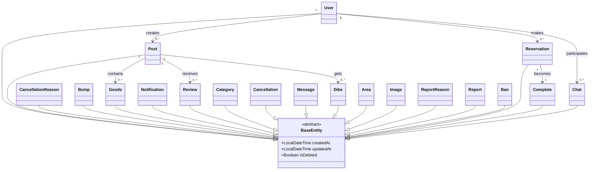

# Entity 설계서

## 문서 정보
- **프로젝트명**: [루키장터]
- **작성자**: [1조/오유식]
- **작성일**: [2025-05-28]
- **버전**: [v1.0]
- **검토자**: [오유식]
- **승인자**: [지재현]

---

## 1. Entity 설계 개요

### 1.1 설계 목적
> JPA Entity 클래스 설계를 통해 객체-관계 매핑(ORM)을 정의하고, 
> 비즈니스 도메인을 코드로 표현하여 유지보수가 용이한 시스템을 구축

### 1.2 설계 원칙
- **단일 책임 원칙**: 하나의 Entity는 하나의 비즈니스 개념만 표현
- **캡슐화**: 비즈니스 로직을 Entity 내부에 구현
- **불변성**: 가능한 한 불변 객체로 설계
- **연관관계 최소화**: 필요한 관계만 매핑하여 복잡도 감소

### 1.3 기술 스택
- **ORM 프레임워크**: Spring Data JPA 2.7.x
- **데이터베이스**: MySQL 8.0
- **검증 프레임워크**: Bean Validation 2.0
- **감사 기능**: Spring Data JPA Auditing

---

## 2. Entity 목록 및 분류

### 2.1 Entity 분류 매트릭스
| Entity명 | 유형 | 비즈니스 중요도 | 기술적 복잡도 | 연관관계 수 | 우선순위 |
|----------|------|----------------|---------------|-------------|----------|
| **Reservation** | 핵심 | 낮음 | 높음 | 3개 | 1순위 |
| **Complete** | 핵심 | 낮음 | 높음 | 3개 | 1순위 |
| **Goods** | 지원 | 낮음 | 높음 | 2개 | 1순위 |
| **Post** | 핵심 | 높음 | 높음 | 8개 | 1순위 |
| **User** | 핵심 | 중간 | 높음 | 10개 | 1순위 |
| **CancellationReason** | 지원 | 중간 | 중간 | 1개 | 2순위 |
| **Bump** | 지원 | 낮음 | 중간 | 1개 | 2순위 |
| **Dibs** | 지원 | 낮음 | 중간 | 2개 | 2순위 |
| **Notification** | 지원 | 중간 | 중간 | 1개 | 2순위 |
| **Review** | 지원 | 낮음 | 중간 | 2개 | 2순위 |
| **Category** | 지원 | 낮음 | 중간 | 1개 | 2순위 |
| **Cancellation** | 이력 | 중 | 높음 | 2개 | 2순위 |
| **Message** | 이력 | 중간 | 높음 | 1개 | 2순위 |
| **Chat** | 핵심 | 높음 | 중간 | 3개 | 2순위 |
| **Area** | 이력 | 낮음 | 낮음 | 1개 | 3순위 |
| **Image** | 이력 | 낮음 | 낮음 | 1개 | 3순위 |
| **ReportReason** | 지원 | 낮음 | 낮음 | 1개 | 3순위 |
| **Report** | 이력 | 중간 | 낮음 | 3개 | 3순위 |
| **Ban** | 이력 | 낮음 | 낮음 | 2개 | 3순위 |

### 2.2 Entity 상속 구조


---

## 3. 공통 설계 규칙

### 3.1 네이밍 규칙
| 구분 | 규칙 | 예시 | 비고 |
|------|------|------|------|
| **Entity 클래스명** | PascalCase | `User`, `ReportReason` | 단수형 사용 |
| **Table** | snake_case | `users`, `report_reasons` | 복수형 사용 |
| **컬럼명** | snake_case | `user_id`, `created_at` | 언더스코어 구분 |
| **연관관계 필드** | camelCase | `memberLoans`, `bookCategory` | 객체 참조명 |
| **boolean 필드** | is_명사,형용사,수동형 | `is_admin`, `is_completed` | 명확한 의미 |
| **Date Time** | 수동형_at | `created_at`, `added_at` | 명확한 의미

### 3.2 공통 어노테이션 규칙
```java
// 기본 Entity 구조
@Entity
@Table(name = "테이블명")
@EntityListeners(AuditingEntityListener.class)
@NoArgsConstructor(access = AccessLevel.PROTECTED)
@Getter
public class EntityName extends BaseEntity {
    // 필드 정의
}
```

### 3.3 ID 생성 전략
| Entity | 전략 | 이유 | 예시 |
|--------|------|------|------|
| **User** | IDENTITY (Auto Increment, unique 식별) | 사용자는 고유해야 하며, 성능상 자동 증가가 적합 | user_id: 1, 2, 3... |
| **Post** | IDENTITY (Auto Increment, 순차 증가) | 게시글 순서 관리 및 성능 최적화 | post_id: 1001, 1002, 1003... |
| **Reservation** | IDENTITY (Auto Increment, 순차 증가) | 예약 순서 관리 및 빠른 조회 | reservation_id: 2001, 2002... |
| **Chat** | IDENTITY (Auto Increment, 순차 증가) | 채팅방 생성 순서 관리 | chat_id: 3001, 3002... |
| **Message** | IDENTITY (Auto Increment, 메시지 순서) | 메시지 전송 순서 보장 필요 | message_id: 10001, 10002... |
| **Dibs** | IDENTITY (Auto Increment, 순차 증가) | 찜하기 순서 관리 | dibs_id: 4001, 4002... |
| **Complete** | IDENTITY (Auto Increment, 순차 증가) | 완료 거래 순서 관리 | complete_id: 5001, 5002... |
| **Review** | IDENTITY (Auto Increment, 순차 증가) | 리뷰 작성 순서 관리 | review_id: 6001, 6002... |
| **Bump** | IDENTITY (Auto Increment, 순차 증가) | 게시글 끌어올리기 순서 관리 | bump_id: 7001, 7002... |
| **Notification** | IDENTITY (Auto Increment, 알림 순서) | 알림 발생 순서 보장 | notification_id: 8001, 8002... |
| **Report** | IDENTITY (Auto Increment, 신고 순서, unique 식별) | 신고 접수 순서 및 고유성 보장 | report_id: 9001, 9002... |
| **Ban** | IDENTITY (Auto Increment, unique 식별) | 제재 이력 고유성 및 순서 관리 | ban_id: 11001, 11002... |
| **Goods** | IDENTITY (Post의 ID를 PK 겸 FK로 사용) | 게시글과 1:1 관계, 참조 무결성 보장 | goods_id = post_id |
| **Cancellation** | IDENTITY (Reservation의 ID를 PK 겸 FK로 사용) | 예약과 1:1 관계, 참조 무결성 보장 | cancellation_id = reservation_id |
| **Category** | IDENTITY (범주 별로 고정된 id 부여, unique 식별) | 카테고리는 미리 정의된 고정값 사용 | category_id: 1(전자기기), 2(의류)... |
| **Area** | IDENTITY (지역 별로 고정된 id 부여, unique 식별) | 지역정보는 행정구역 기준 고정값 | area_id: 1(서울), 2(부산)... |
| **ReportReason** | IDENTITY (사유 별로 고정된 id 부여) | 신고사유는 미리 정의된 고정 코드값 | reason_id: 1(스팸), 2(욕설)... |
| **CancelReason** | IDENTITY (사유 별로 고정된 id 부여) | 취소사유는 미리 정의된 고정 코드값 | reason_id: 1(단순변심), 2(상품결함)... |
---

## 4. 상세 Entity 설계

### 4.1 Notification Entity

#### 4.1.1 기본 정보

#### 4.1.2 필드 상세 명세
| 필드명 | 데이터 타입 | 컬럼명 | 제약조건 | 설명 | 비즈니스 규칙 |
|--------|-------------|--------|----------|------|---------------|
| **notificationId** | Long | notification_id | NOT NULL, PK | 알림 고유 식별자 | 시스템에서 자동 생성되는 고유값 |
| **userId** | Long | user_id | NOT NULL, FK | 알림 수신자 사용자 ID | 반드시 존재하는 사용자여야 함 |
| **entityId** | Long | entity_id | NULL 허용 | 연관된 엔티티의 ID | 특정 객체와 연관된 알림인 경우 사용 |
| **entityType** | String | entity_type | VARCHAR(10), NULL 허용 | 연관된 엔티티 타입 | POST, COMMENT, USER 등의 값 |
| **message** | String | message | VARCHAR(255), NULL 허용 | 알림 메시지 내용 | 사용자에게 표시될 알림 텍스트 |
| **sentAt** | LocalDateTime | sent_at | NULL 허용 | 알림 발송 시간 | 기본값은 현재 시간 |
| **isRead** | Boolean | is_read | NULL 허용 | 읽음 여부 | 기본값은 false (미읽음) |

#### 4.1.3 검증 어노테이션

#### 4.1.4 연관관계 매핑

#### 4.1.5 비즈니스 메서드

#### 4.1.6 생성자 및 팩토리 메서드


### 4.2 Category Entity
#### 4.2.1 기본 정보
#### 4.2.2 필드 상세 명세
| 필드명 | 데이터 타입 | 컬럼명 | 제약조건 | 설명 | 비즈니스 규칙 |
|--------|-------------|--------|----------|------|---------------|
| **category_id** | INT | category_id | NOT NULL | 카테고리의 고유 식별자 | 각 카테고리마다 고유한 정수값 할당, NULL 값 허용하지 않음 |
| **category_name** | VARCHAR(20) | category_name | NULL 허용 | 카테고리의 이름 | 최대 20자까지 입력
#### 4.2.3 검증 어노테이션
#### 4.2.4 연관관계 매핑
#### 4.2.5 비즈니스 메서드
#### 4.2.6 생성자 및 팩토리 메서드

### 4.3 Reports Entity
#### 4.3.1 기본 정보
#### 4.3.2 필드 상세 명세
| 필드명 | 데이터 타입 | 컬럼명 | 제약조건 | 설명 | 비즈니스 규칙 |
|--------|-------------|--------|----------|------|---------------|
| **report_id** | BIGINT | report_id | NOT NULL | 신고의 고유 식별자 | 각 신고마다 고유한 정수값 할당 NULL 값 허용하지 않음 Primary Key로 사용 권장 |
| **report_reason_id** | INT | report_reason_id | NOT NULL | 신고 사유의 식별자 | 신고 사유 테이블과 연결되는 외래키 NULL 값 허용하지 않음 사전에 정의된 신고 사유 중 하나를 선택 |
| **user_id** | BIGINT | user_id | NOT NULL | 신고한 사용자의 식별자 | 신고자의 고유 식별자 사용자 테이블과 연결되는 외래키 NULL 값 허용하지 않음 |
| **target_id** | BIGINT | target_id | NULL 허용 | 신고 대상의 식별자 | 신고 대상(게시물, 댓글 등)의 고유 식별자 NULL 값 허용 target_type과 함께 사용하여 신고 대상 특정 |
| **target_type** | VARCHAR(10) | target_type | NULL 허용 | 신고 대상의 유형 | 신고 대상의 종류 구분 (예: POST, COMMENT, USER 등) 최대 10자까지 입력 가능 NULL 값 허용 |
| **report_detail** | VARCHAR(255) | report_detail | NULL 허용 | 신고에 대한 상세 설명 | 신고자가 작성한 추가 설명 최대 255자까지 입력 가능 NULL 값 허용 |
| **is_processed** | BOOLEAN | is_processed | NULL 허용 | 신고 처리 완료 여부 | true: 처리 완료, false: 미처리 NULL 값 허용 (기본값 false 권장) 관리자의 신고 처리 상태 추적용 |
#### 4.3.3 검증 어노테이션
#### 4.3.4 연관관계 매핑
#### 4.3.5 비즈니스 메서드
#### 4.3.6 생성자 및 팩토리 메서드

### 4.4 Bumps Entity
#### 4.4.1 기본 정보
#### 4.4.2 필드 상세 명세
| 필드명 | 데이터 타입 | 컬럼명 | 제약조건 | 설명 | 비즈니스 규칙 |
|--------|-------------|--------|----------|------|---------------|
| **bump_id** | BIGINT | bump_id | NOT NULL | 범프의 고유 식별자 |각 범프마다 고유한 정수값 할당, NULL 값 허용하지 않음, Primary Key로 사용 권장 |
| **post_id** | BIGINT | post_id | NOT NULL | 범프 대상 게시물의 식별자 |게시물 테이블과 연결되는 외래키, NULL 값 허용하지 않음, 범프할 게시물을 특정 |
| **bumped_at** | TIMESTAMP | bumped_at | NULL 허용 | 범프가 실행된 일시 |범프 발생 시점 기록, NULL 값 허용, 자동으로 현재 시간 설정 권장 |
| **bump_count** | INT | bump_count | NULL 허용 | 범프 실행 횟수 |해당 게시물의 총 범프 횟수, NULL 값 허용, 기본값 1로 설정 권장, 범프 시마다 증가 |
#### 4.4.3 검증 어노테이션
#### 4.4.4 연관관계 매핑
#### 4.4.5 비즈니스 메서드
#### 4.4.6 생성자 및 팩토리 메서드

### 4.5 Dibs Entity
#### 4.5.1 기본 정보
#### 4.5.2 필드 상세 명세
| 필드명 | 데이터 타입 | 컬럼명 | 제약조건 | 설명 | 비즈니스 규칙 |
|--------|-------------|--------|----------|------|---------------|
| **dibs_id** | BIGINT | dibs_id | NOT NULL | 찜의 고유 식별자 | 각 찜마다 고유한 정수값 할당, NULL 값 허용하지 않음, Primary Key로 사용 권장 |
| **user_id** | BIGINT | user_id | NOT NULL | 찜한 사용자의 식별자 | 찜을 한 사용자의 고유 식별자, 사용자 테이블과 연결되는 외래키, NULL 값 허용하지 않음 |
| **post_id** | BIGINT | post_id | NOT NULL | 찜한 게시물의 식별자 | 찜 대상 게시물의 고유 식별자, 게시물 테이블과 연결되는 외래키, NULL 값 허용하지 않음 |
| **added_at** | TIMESTAMP | added_at | NULL 허용 | 찜이 추가된 일시 | 찜 등록 시점 기록, NULL 값 허용, 자동으로 현재 시간 설정 권장 |

#### 4.5.3 검증 어노테이션
#### 4.5.4 연관관계 매핑
#### 4.5.5 비즈니스 메서드
#### 4.5.6 생성자 및 팩토리 메서드

### 4.6 Reservations Entity
#### 4.6.1 기본 정보
#### 4.6.2 필드 상세 명세
| 필드명 | 데이터 타입 | 컬럼명 | 제약조건 | 설명 | 비즈니스 규칙 |
|--------|-------------|--------|----------|------|---------------|
| **reservation_id** | BIGINT | reservation_id | NOT NULL | 예약의 고유 식별자 | 각 예약마다 고유한 정수값 할당, NULL 값 허용하지 않음, Primary Key로 사용 권장 |
| **buyer_id** | BIGINT | buyer_id | NOT NULL | 구매자의 식별자 | 상품을 예약한 구매자의 고유 식별자, 사용자 테이블과 연결되는 외래키, NULL 값 허용하지 않음 |
| **seller_id** | BIGINT | seller_id | NOT NULL | 판매자의 식별자 | 상품을 판매하는 판매자의 고유 식별자, 사용자 테이블과 연결되는 외래키, NULL 값 허용하지 않음 |
| **post_id** | BIGINT | post_id | NOT NULL | 예약된 게시물의 식별자 | 예약 대상 게시물의 고유 식별자, 게시물 테이블과 연결되는 외래키, NULL 값 허용하지 않음 |

#### 4.6.3 검증 어노테이션
#### 4.6.4 연관관계 매핑
#### 4.6.5 비즈니스 메서드
#### 4.6.6 생성자 및 팩토리 메서드

### 4.7 Messages Entity
#### 4.7.1 기본 정보
#### 4.7.2 필드 상세 명세
| 필드명 | 데이터 타입 | 컬럼명 | 제약조건 | 설명 | 비즈니스 규칙 |
|--------|-------------|--------|----------|------|---------------|
| **message_id** | BIGINT | message_id | NOT NULL | 메시지의 고유 식별자 | 기본키로 사용, 자동 증가 값 권장, 중복 불가 |
| **chat_id** | BIGINT | chat_id | NOT NULL | 메시지가 속한 채팅방의 식별자 | 외래키로 사용, chats 테이블의 chat_id 참조, 필수 입력 값 |
| **content** | VARCHAR(255) | content | NOT NULL | 메시지 내용 | 최대 255자까지 입력 가능, 빈 문자열 허용하지 않음, 특수문자, 이모지 포함 가능 |
| **sent_at** | TIMESTAMP | sent_at | NULL | 메시지 전송 시각 | 메시지 생성 시 자동으로 현재 시간 설정 권장, NULL 허용 (임시 저장된 메시지의 경우), UTC 기준으로 저장 권장 |
| **is_read** | BOOLEAN | is_read | NULL | 메시지 읽음 여부 | 기본값: FALSE, TRUE: 읽음, FALSE: 읽지 않음, NULL: 읽음 상태 미확인 |
#### 4.7.3 검증 어노테이션
#### 4.7.4 연관관계 매핑
#### 4.7.5 비즈니스 메서드
#### 4.7.6 생성자 및 팩토리 메서드

### 4.8 Images Entity
#### 4.8.1 기본 정보
#### 4.8.2 필드 상세 명세
| 필드명 | 데이터 타입 | 컬럼명 | 제약조건 | 설명 | 비즈니스 규칙 |
|--------|-------------|--------|----------|------|---------------|
| **image_id** | BIGINT | image_id | NOT NULL | 이미지의 고유 식별자 | 기본키로 사용, 자동 증가 값 권장, 중복 불가 |
| **post_id** | BIGINT | post_id | NOT NULL | 이미지가 속한 게시물의 식별자 | 외래키로 사용, posts 테이블의 post_id 참조, 필수 입력 값 |
| **image_url** | VARCHAR(255) | image_url | NOT NULL | 이미지 파일의 URL 경로 | 최대 255자까지 입력 가능, 유효한 URL 형식이어야 함, 절대 경로 또는 상대 경로 허용, 빈 문자열 허용하지 않음 |
#### 4.8.3 검증 어노테이션
#### 4.8.4 연관관계 매핑
#### 4.8.5 비즈니스 메서드
#### 4.8.6 생성자 및 팩토리 메서드

### 4.9 Users Entity
#### 4.9.1 기본 정보
#### 4.9.2 필드 상세 명세
| 필드명 | 데이터 타입 | 컬럼명 | 제약조건 | 설명 | 비즈니스 규칙 |
|--------|-------------|--------|----------|------|---------------|
| **user_id** | BIGINT | user_id | NOT NULL | 사용자의 고유 식별자 | 기본키로 사용, 자동 증가 값 권장, 중복 불가 |
| **area_id** | INT | area_id | NOT NULL | 사용자가 속한 지역의 식별자 | 외래키로 사용, areas 테이블의 area_id 참조, 필수 입력 값 |
| **login_id** | VARCHAR(20) | login_id | NOT NULL | 로그인용 사용자 아이디 | 최대 20자까지 입력 가능, 영문, 숫자 조합 권장, 중복 불가 (UNIQUE 제약조건 필요), 빈 문자열 허용하지 않음 |
| **password** | VARCHAR(20) | password | NOT NULL | 사용자 비밀번호 | 최대 20자까지 입력 가능, 암호화하여 저장 권장, 특수문자 포함 권장, 빈 문자열 허용하지 않음 |
| **user_name** | VARCHAR(12) | user_name | NOT NULL | 사용자 실명 또는 닉네임 | 최대 12자까지 입력 가능, 한글, 영문 모두 허용, 빈 문자열 허용하지 않음 |
| **phone** | VARCHAR(12) | phone | NOT NULL | 사용자 전화번호 | 최대 12자까지 입력 가능, 숫자와 하이픈(-) 허용, 중복 불가 (UNIQUE 제약조건 권장), 빈 문자열 허용하지 않음 |
| **is_banned** | BOOLEAN | is_banned | NULL | 사용자 차단 여부 | 기본값: FALSE, TRUE: 차단됨, FALSE: 정상, NULL: 차단 상태 미확인 |
| **is_admin** | BOOLEAN | is_admin | NULL | 관리자 권한 여부 | 기본값: FALSE, TRUE: 관리자, FALSE: 일반 사용자, NULL: 권한 상태 미확인 |
#### 4.9.3 검증 어노테이션
#### 4.9.4 연관관계 매핑
#### 4.9.5 비즈니스 메서드
#### 4.9.6 생성자 및 팩토리 메서드

### 4.10 Bans Entity
#### 4.10.1 기본 정보
#### 4.10.2 필드 상세 명세
| 필드명 | 데이터 타입 | 컬럼명 | 제약조건 | 설명 | 비즈니스 규칙 |
|--------|-------------|--------|----------|------|---------------|
| **ban_id** | BIGINT | ban_id | NOT NULL | 차단의 고유 식별자 | 기본키로 사용, 자동 증가 값 권장, 중복 불가 |
| **user_id** | BIGINT | user_id | NOT NULL | 차단된 사용자의 식별자 | 외래키로 사용, users 테이블의 user_id 참조, 필수 입력 값 |
| **report_id** | BIGINT | report_id | NOT NULL | 차단 근거가 된 신고의 식별자 | 외래키로 사용, reports 테이블의 report_id 참조, 필수 입력 값 |
| **ban_reason** | VARCHAR(50) | ban_reason | NULL | 차단 사유 설명 | 최대 50자까지 입력 가능, NULL 허용 (기본 차단 사유 적용), 관리자가 직접 입력하는 상세 사유 |
#### 4.10.3 검증 어노테이션
#### 4.10.4 연관관계 매핑
#### 4.10.5 비즈니스 메서드
#### 4.10.6 생성자 및 팩토리 메서드

### 4.11 areas Entity
#### 4.11.1 기본 정보
#### 4.11.2 필드 상세 명세
| 필드명 | 데이터 타입 | 컬럼명 | 제약조건 | 설명 | 비즈니스 규칙 |
|--------|-------------|--------|----------|------|---------------|
| **area_id** | INT | area_id | NOT NULL | 지역의 고유 식별자 | 기본키로 사용, 자동 증가 값 권장, 중복 불가 |
| **area_name** | VARCHAR(50) | area_name | NULL | 지역명 | 최대 50자까지 입력 가능, NULL 허용 (미분류 지역의 경우), 예: '서울특별시', '부산광역시', '경기도' 등 |
#### 4.11.3 검증 어노테이션
#### 4.11.4 연관관계 매핑
#### 4.11.5 비즈니스 메서드
#### 4.11.6 생성자 및 팩토리 메서드

### 4.12 Posts Entity
#### 4.12.1 기본 정보
#### 4.12.2 필드 상세 명세
| 필드명 | 데이터 타입 | 컬럼명 | 제약조건 | 설명 | 비즈니스 규칙 |
|--------|-------------|--------|----------|------|---------------|
| **post_id** | BIGINT | post_id | NOT NULL | 게시물의 고유 식별자 | 기본키로 사용, 자동 증가 값 권장, 중복 불가 |
| **category_id** | INT | category_id | NOT NULL | 게시물이 속한 카테고리의 식별자 | 외래키로 사용, categories 테이블의 category_id 참조, 필수 입력 값 |
| **user_id** | BIGINT | user_id | NULL | 게시물 작성자의 식별자 | 외래키로 사용, users 테이블의 user_id 참조, NULL 허용 (익명 게시물 또는 탈퇴한 사용자) |
| **title** | VARCHAR(50) | title | NOT NULL | 게시물 제목 | 최대 50자까지 입력 가능, 빈 문자열 허용하지 않음, 특수문자 포함 가능 |
| **content** | VARCHAR(255) | content | NOT NULL | 게시물 내용 | 최대 255자까지 입력 가능, 빈 문자열 허용하지 않음, 특수문자, 줄바꿈 포함 가능 |
| **view_count** | INT | view_count | NULL | 게시물 조회수 | 기본값: 0, 음수 값 허용하지 않음, NULL 허용 (조회수 미집계 상태) |
| **is_bumped** | BOOLEAN | is_bumped | NULL | 게시물 끌어올리기 여부 | 기본값: FALSE, TRUE: 끌어올림, FALSE: 일반, NULL: 끌어올리기 상태 미확인 |
| **is_reserved** | BOOLEAN | is_reserved | NULL | 게시물 예약 여부 | 기본값: FALSE, TRUE: 예약됨, FALSE: 예약 안됨, NULL: 예약 상태 미확인 |
| **is_completed** | BOOLEAN | is_completed | NULL | 게시물 완료 여부 | 기본값: FALSE, TRUE: 완료됨, FALSE: 진행중, NULL: 완료 상태 미확인 |
#### 4.12.3 검증 어노테이션
#### 4.12.4 연관관계 매핑
#### 4.12.5 비즈니스 메서드
#### 4.12.6 생성자 및 팩토리 메서드

### 4.13 Reviews Entity
#### 4.13.1 기본 정보
#### 4.13.2 필드 상세 명세
| 필드명 | 데이터 타입 | 컬럼명 | 제약조건 | 설명 | 비즈니스 규칙 |
|--------|-------------|--------|----------|------|---------------|
| **review_id** | BIGINT | review_id | NOT NULL | 리뷰의 고유 식별자 | 기본키로 사용, 자동 증가 값 권장, 중복 불가 |
| **complete_id** | BIGINT | complete_id | NOT NULL | 완료된 거래의 식별자 | 외래키로 사용, completes 테이블의 complete_id 참조, 필수 입력 값 |
| **user_id** | BIGINT | user_id | NULL | 리뷰 작성자의 식별자 | 외래키로 사용, users 테이블의 user_id 참조, NULL 허용 (익명 리뷰 또는 탈퇴한 사용자) |
| **rating** | INT | rating | NOT NULL | 평점 점수 | 1~5점 범위 권장, 음수 값 허용하지 않음, 필수 입력 값 |
| **content** | VARCHAR(255) | content | NULL | 리뷰 내용 | 최대 255자까지 입력 가능, NULL 허용 (평점만 등록하는 경우), 특수문자, 줄바꿈 포함 가능 |
#### 4.13.3 검증 어노테이션
#### 4.13.4 연관관계 매핑
#### 4.13.5 비즈니스 메서드
#### 4.13.6 생성자 및 팩토리 메서드

### 4.14 Completes Entity
#### 4.14.1 기본 정보
#### 4.14.2 필드 상세 명세
| 필드명 | 데이터 타입 | 컬럼명 | 제약조건 | 설명 | 비즈니스 규칙 |
|--------|-------------|--------|----------|------|---------------|
| **complete_id** | BIGINT | complete_id | NOT NULL | 완료된 거래의 고유 식별자 | 기본키로 사용, 자동 증가 값 권장, 중복 불가 |
| **post_id** | BIGINT | post_id | NULL | 거래 완료된 게시물의 식별자 | 외래키로 사용, posts 테이블의 post_id 참조, NULL 허용 (게시물 삭제된 경우) |
| **buyer_id** | BIGINT | buyer_id | NULL | 구매자의 식별자 | 외래키로 사용, users 테이블의 user_id 참조, NULL 허용 (익명 거래 또는 탈퇴한 사용자) |
| **seller_id** | BIGINT | seller_id | NULL | 판매자의 식별자 | 외래키로 사용, users 테이블의 user_id 참조, NULL 허용 (익명 거래 또는 탈퇴한 사용자) |
| **completed_at** | TIMESTAMP | completed_at | NULL | 거래 완료 시각 | 거래 완료 시 자동으로 현재 시간 설정 권장, NULL 허용 (완료 시간 미기록), UTC 기준으로 저장 권장 |
#### 4.14.3 검증 어노테이션
#### 4.14.4 연관관계 매핑
#### 4.14.5 비즈니스 메서드
#### 4.14.6 생성자 및 팩토리 메서드

### 4.15 Goods Entity
#### 4.15.1 기본 정보
#### 4.15.2 필드 상세 명세
| 필드명 | 데이터 타입 | 컬럼명 | 제약조건 | 설명 | 비즈니스 규칙 |
|--------|-------------|--------|----------|------|---------------|
| **post_id** | BIGINT | post_id | NOT NULL | 상품이 등록된 게시물의 식별자 | 기본키로 사용, 외래키로 사용, posts 테이블의 post_id 참조, 중복 불가 |
| **goods_name** | VARCHAR(50) | goods_name | NULL | 상품명 | 최대 50자까지 입력 가능, NULL 허용 (상품명 미등록), 특수문자 포함 가능 |
| **price** | INT | price | NULL | 상품 가격 | 원 단위로 저장, 음수 값 허용하지 않음, NULL 허용 (가격 협의 또는 무료 나눔) |
#### 4.15.3 검증 어노테이션
#### 4.15.4 연관관계 매핑
#### 4.15.5 비즈니스 메서드
#### 4.15.6 생성자 및 팩토리 메서드

### 4.16 Cancelations Entity
#### 4.16.1 기본 정보
#### 4.16.2 필드 상세 명세
| 필드명 | 데이터 타입 | 컬럼명 | 제약조건 | 설명 | 비즈니스 규칙 |
|--------|-------------|--------|----------|------|---------------|
| **reservation_id** | BIGINT | reservation_id | NOT NULL | 취소된 예약의 식별자 | 기본키로 사용, 외래키로 사용, reservations 테이블의 reservation_id 참조, 중복 불가 |
| **cancelation_reason_id** | INT | cancelation_reason_id | NOT NULL | 취소 사유의 식별자 | 외래키로 사용, cancelation_reasons 테이블의 cancelation_reason_id 참조, 필수 입력 값 |
| **report_detail** | VARCHAR(255) | report_detail | NULL | 취소 상세 내용 | 최대 255자까지 입력 가능, NULL 허용 (기본 취소 사유만 적용), 사용자가 직접 입력하는 상세 사유 |
| **canceled_at** | TIMESTAMP | canceled_at | NULL | 취소 처리 시각 | 취소 처리 시 자동으로 현재 시간 설정 권장, NULL 허용 (취소 시간 미기록), UTC 기준으로 저장 권장 |
#### 4.16.3 검증 어노테이션
#### 4.16.4 연관관계 매핑
#### 4.16.5 비즈니스 메서드
#### 4.16.6 생성자 및 팩토리 메서드

### 4.17 Chats Entity
#### 4.17.1 기본 정보
#### 4.17.2 필드 상세 명세
| 필드명 | 데이터 타입 | 컬럼명 | 제약조건 | 설명 | 비즈니스 규칙 |
|--------|-------------|--------|----------|------|---------------|
| **chat_id** | BIGINT | chat_id | NOT NULL | 채팅방의 고유 식별자 | 기본키로 사용<br>자동 증가 값 권장, 중복 불가 |
| **buyer_id** | BIGINT | buyer_id | NULL | 구매자의 식별자 | 외래키로 사용, users 테이블의 user_id 참조, NULL 허용 (익명 채팅 또는 탈퇴한 사용자) |
| **seller_id** | BIGINT | seller_id | NULL | 판매자의 식별자 | 외래키로 사용, users 테이블의 user_id 참조, NULL 허용 (익명 채팅 또는 탈퇴한 사용자) |
| **post_id** | BIGINT | post_id | NULL | 채팅 관련 게시물의 식별자 | 외래키로 사용, posts 테이블의 post_id 참조, NULL 허용 (게시물 삭제된 경우) |
#### 4.17.3 검증 어노테이션
#### 4.17.4 연관관계 매핑
#### 4.17.5 비즈니스 메서드
#### 4.17.6 생성자 및 팩토리 메서드

### 4.18 Cancelation_reasons Entity
#### 4.18.1 기본 정보
#### 4.18.2 필드 상세 명세
| 필드명 | 데이터 타입 | 컬럼명 | 제약조건 | 설명 | 비즈니스 규칙 |
|--------|-------------|--------|----------|------|---------------|
| **cancelation_reason_id** | INT | cancelation_reason_id | NOT NULL | 취소 사유의 고유 식별자 | 기본키로 사용, 자동 증가 값 권장, 중복 불가 |
| **cancelation_reason_type** | VARCHAR(50) | cancelation_reason_type | NULL | 취소 사유 유형 | 최대 50자까지 입력 가능, NULL 허용 (기타 사유의 경우), 예: '단순 변심', '상품 불만족', '일정 변경' 등 |
#### 4.18.3 검증 어노테이션
#### 4.18.4 연관관계 매핑
#### 4.18.5 비즈니스 메서드
#### 4.18.6 생성자 및 팩토리 메서드

### 4.19 Report_reasons Entity
#### 4.19.1 기본 정보
#### 4.19.2 필드 상세 명세
| 필드명 | 데이터 타입 | 컬럼명 | 제약조건 | 설명 | 비즈니스 규칙 |
|--------|-------------|--------|----------|------|---------------|
| **report_reason_id** | INT | report_reason_id | NOT NULL | 신고 사유의 고유 식별자 | 기본키로 사용, 자동 증가 값 권장, 중복 불가 |
| **report_reason_type** | VARCHAR(50) | report_reason_type | NULL | 신고 사유 유형 | 최대 50자까지 입력 가능, NULL 허용 (기타 사유의 경우), 예: '스팸', '욕설', '부적절한 내용' 등 |
#### 4.19.3 검증 어노테이션
#### 4.19.4 연관관계 매핑
#### 4.19.5 비즈니스 메서드
#### 4.19.6 생성자 및 팩토리 메서드


## 5. Enum 타입 정의
---

## 6. 연관관계 매핑 전략

### 6.1 연관관계 매핑 규칙
| 관계 유형 | 기본 전략 | 이유 | 예외 상황 |
|----------|-----------|------|-----------|
| **@ManyToOne** | LAZY | 성능 최적화 | 필수 조회 데이터는 EAGER |
| **@OneToMany** | LAZY | N+1 문제 방지 | 소량 데이터는 EAGER |
| **@OneToOne** | LAZY | 일관성 유지 | 항상 함께 조회하는 경우 EAGER |
| **@ManyToMany** | 사용 금지 | 복잡성 증가 | 중간 테이블로 대체 |

### 6.2 Cascade 옵션 가이드
```java
// 부모-자식 관계 (강한 연결)
@OneToMany(mappedBy = "member", cascade = CascadeType.ALL, orphanRemoval = true)
private List<Loan> loans = new ArrayList<>();

// 참조 관계 (약한 연결)
@ManyToOne(fetch = FetchType.LAZY)
@JoinColumn(name = "category_id")
private Category category; // cascade 없음

// 선택적 관계
@OneToMany(mappedBy = "book", cascade = {CascadeType.PERSIST, CascadeType.MERGE})
private List<Reservation> reservations = new ArrayList<>();
```

### 6.3 양방향 연관관계 관리
```java
// Member Entity에서
public void addLoan(Loan loan) {
    loans.add(loan);
    loan.setMember(this); // 양방향 연관관계 동기화
}

public void removeLoan(Loan loan) {
    loans.remove(loan);
    loan.setMember(null);
}

// Loan Entity에서
public void setMember(Member member) {
    // 기존 관계 제거
    if (this.member != null) {
        this.member.getLoans().remove(this);
    }
    
    this.member = member;
    
    // 새로운 관계 설정
    if (member != null && !member.getLoans().contains(this)) {
        member.getLoans().add(this);
    }
}
```

---

## 7. 감사(Auditing) 설정

### 7.1 BaseEntity 구현
```java
@MappedSuperclass
@EntityListeners(AuditingEntityListener.class)
@Getter
public abstract class BaseEntity {

    @Id
    @GeneratedValue(strategy = GenerationType.IDENTITY)
    @Column(name = "id")
    private Long id;

    @CreatedDate
    @Column(name = "created_at", nullable = false, updatable = false)
    private LocalDateTime createdAt;

    @LastModifiedDate
    @Column(name = "updated_at")
    private LocalDateTime updatedAt;

    @CreatedBy
    @Column(name = "created_by", updatable = false)
    private String createdBy;

    @LastModifiedBy
    @Column(name = "last_modified_by")
    private String lastModifiedBy;

    @Version
    @Column(name = "version")
    private Long version;

    // equals, hashCode는 id 기반으로 구현
    @Override
    public boolean equals(Object o) {
        if (this == o) return true;
        if (o == null || getClass() != o.getClass()) return false;
        BaseEntity that = (BaseEntity) o;
        return Objects.equals(id, that.id);
    }

    @Override
    public int hashCode() {
        return Objects.hash(id);
    }
}
```

### 7.2 Auditing 설정
```java
@Configuration
@EnableJpaAuditing
public class JpaAuditingConfig {

    @Bean
    public AuditorAware<String> auditorProvider() {
        return () -> {
            // Spring Security에서 현재 사용자 정보 조회
            Authentication authentication = SecurityContextHolder.getContext().getAuthentication();
            
            if (authentication == null || !authentication.isAuthenticated()) {
                return Optional.of("SYSTEM");
            }
            
            return Optional.of(authentication.getName());
        };
    }
}
```

---

## 8. 성능 최적화 전략

### 8.1 인덱스 설계 전략
```java
// 복합 인덱스 - 자주 함께 조회되는 컬럼
@Table(name = "loans", indexes = {
    @Index(name = "idx_member_status", columnList = "member_id, status"),
    @Index(name = "idx_book_status_date", columnList = "book_id, status, loan_date"),
    @Index(name = "idx_due_date_status", columnList = "due_date, status")
})

// 단일 인덱스 - 검색 조건으로 자주 사용
@Index(name = "idx_loan_number", columnList = "loan_number", unique = true)
@Index(name = "idx_created_at", columnList = "created_at")
```

### 8.2 N+1 문제 해결
```java
// Repository에서 fetch join 사용
public interface LoanRepository extends JpaRepository<Loan, Long> {
    
    @Query("SELECT l FROM Loan l " +
           "JOIN FETCH l.member m " +
           "JOIN FETCH l.book b " +
           "JOIN FETCH b.category " +
           "WHERE l.status = :status")
    List<Loan> findByStatusWithDetails(@Param("status") LoanStatus status);
    
    // @EntityGraph 사용
    @EntityGraph(attributePaths = {"member", "book", "book.category"})
    List<Loan> findByMemberIdAndStatus(Long memberId, LoanStatus status);
}
```

### 8.3 쿼리 최적화
```java
// 페이징과 정렬
@Query("SELECT l FROM Loan l " +
       "WHERE l.member.id = :memberId " +
       "ORDER BY l.createdAt DESC")
Page<Loan> findByMemberIdOrderByCreatedAtDesc(
    @Param("memberId") Long memberId, 
    Pageable pageable);

// 집계 쿼리
@Query("SELECT COUNT(l) FROM Loan l " +
       "WHERE l.member.id = :memberId " +
       "AND l.status = :status")
long countByMemberIdAndStatus(
    @Param("memberId") Long memberId, 
    @Param("status") LoanStatus status);

// 조건부 쿼리 (Specifications 활용)
public class LoanSpecifications {
    public static Specification<Loan> hasStatus(LoanStatus status) {
        return (root, query, criteriaBuilder) ->
            status == null ? null : criteriaBuilder.equal(root.get("status"), status);
    }
    
    public static Specification<Loan> isOverdue() {
        return (root, query, criteriaBuilder) ->
            criteriaBuilder.and(
                criteriaBuilder.equal(root.get("status"), LoanStatus.BORROWED),
                criteriaBuilder.lessThan(root.get("dueDate"), LocalDate.now())
            );
    }
}
```

---

## 9. 검증 및 제약조건

### 9.1 Bean Validation 어노테이션
```java
// 커스텀 검증 어노테이션
@Target({ElementType.FIELD})
@Retention(RetentionPolicy.RUNTIME)
@Constraint(validatedBy = ISBNValidator.class)
public @interface ValidISBN {
    String message() default "유효하지 않은 ISBN입니다";
    Class<?>[] groups() default {};
    Class<? extends Payload>[] payload() default {};
}

// 검증 구현 클래스
public class ISBNValidator implements ConstraintValidator<ValidISBN, String> {
    
    @Override
    public boolean isValid(String isbn, ConstraintValidatorContext context) {
        if (isbn == null || isbn.length() != 13) {
            return false;
        }
        
        // ISBN-13 체크섬 검증 로직
        try {
            int sum = 0;
            for (int i = 0; i < 12; i++) {
                int digit = Character.getNumericValue(isbn.charAt(i));
                sum += (i % 2 == 0) ? digit : digit * 3;
            }
            int checkDigit = 10 - (sum % 10);
            if (checkDigit == 10) checkDigit = 0;
            
            return checkDigit == Character.getNumericValue(isbn.charAt(12));
        } catch (NumberFormatException e) {
            return false;
        }
    }
}

// Entity에서 사용
@ValidISBN
@Column(nullable = false, unique = true, length = 13)
private String isbn;
```

### 9.2 데이터베이스 제약조건
```java
// 체크 제약조건
@Entity
@Table(name = "books", 
    uniqueConstraints = {
        @UniqueConstraint(columnNames = {"isbn"}),
        @UniqueConstraint(columnNames = {"title", "author", "publisher"})
    },
    // MySQL에서는 체크 제약조건 대신 트리거 사용
    indexes = {
        @Index(name = "idx_isbn", columnList = "isbn"),
        @Index(name = "idx_title_author", columnList = "title, author")
    }
)
public class Book extends BaseEntity {
    
    // JPA 수준에서 검증
    @PrePersist
    @PreUpdate
    private void validateConstraints() {
        if (availableCopies > totalCopies) {
            throw new IllegalArgumentException(
                "대출가능 권수는 총 권수를 초과할 수 없습니다");
        }
        if (totalCopies < 1) {
            throw new IllegalArgumentException(
                "총 권수는 1 이상이어야 합니다");
        }
    }
}
```

---

## 10. 테스트 전략

### 10.1 Entity 단위 테스트
```java
@DisplayName("Member Entity 테스트")
class MemberTest {

    @Test
    @DisplayName("회원 생성 시 기본값이 올바르게 설정되어야 한다")
    void createMember_ShouldSetDefaultValues() {
        // given
        String name = "김철수";
        String email = "kim@test.com";
        String password = "password123";
        
        // when
        Member member = Member.createMember(name, email, password, null, null, null);
        
        // then
        assertThat(member.getStatus()).isEqualTo(MemberStatus.ACTIVE);
        assertThat(member.getMaxLoanCount()).isEqualTo(5);
        assertThat(member.getMemberNumber()).startsWith("M");
        assertThat(member.getMemberNumber()).hasSize(10);
    }

    @Test
    @DisplayName("추가 대출 가능 여부를 올바르게 판단해야 한다")
    void canLoanMore_ShouldReturnCorrectResult() {
        // given
        Member member = createTestMember();
        
        // 현재 5권 대출 중 (최대 대출 권수)
        for (int i = 0; i < 5; i++) {
            Loan loan = createActiveLoan(member);
            member.getLoans().add(loan);
        }
        
        // when & then
        assertThat(member.canLoanMore()).isFalse();
    }

    @Test
    @DisplayName("연체 도서 보유 여부를 올바르게 판단해야 한다")
    void hasOverdueLoans_ShouldReturnTrue_WhenOverdueLoansExist() {
        // given
        Member member = createTestMember();
        Loan overdueLoan = createOverdueLoan(member);
        member.getLoans().add(overdueLoan);
        
        // when & then
        assertThat(member.hasOverdueLoans()).isTrue();
    }
}
```

### 10.2 Repository 테스트
```java
@DataJpaTest
@DisplayName("LoanRepository 테스트")
class LoanRepositoryTest {

    @Autowired
    private TestEntityManager entityManager;

    @Autowired
    private LoanRepository loanRepository;

    @Test
    @DisplayName("회원 ID와 상태로 대출 목록을 조회해야 한다")
    void findByMemberIdAndStatus_ShouldReturnLoans() {
        // given
        Member member = createAndSaveMember();
        Book book = createAndSaveBook();
        Loan loan = createAndSaveLoan(member, book, LoanStatus.BORROWED);
        
        // when
        List<Loan> result = loanRepository.findByMemberIdAndStatus(
            member.getId(), LoanStatus.BORROWED);
        
        // then
        assertThat(result).hasSize(1);
        assertThat(result.get(0).getId()).isEqualTo(loan.getId());
    }

    @Test
    @DisplayName("연체된 대출 목록을 조회해야 한다")
    void findOverdueLoans_ShouldReturnOverdueLoans() {
        // given
        Member member = createAndSaveMember();
        Book book = createAndSaveBook();
        Loan overdueLoan = createAndSaveLoan(member, book, LoanStatus.BORROWED);
        
        // 반납예정일을 과거로 설정
        overdueLoan.setDueDate(LocalDate.now().minusDays(1));
        entityManager.persistAndFlush(overdueLoan);
        
        // when
        List<Loan> result = loanRepository.findOverdueLoans();
        
        // then
        assertThat(result).hasSize(1);
        assertThat(result.get(0).isOverdue()).isTrue();
    }
}
```

---

## 11. 성능 모니터링

### 11.1 쿼리 성능 모니터링
```properties
# application.properties - 쿼리 성능 모니터링 설정

# 로깅 레벨 설정
logging.level.org.hibernate.SQL=DEBUG
logging.level.org.hibernate.type.descriptor.sql.BasicBinder=TRACE
logging.level.org.hibernate.stat=DEBUG
logging.level.org.springframework.jdbc.core=DEBUG

# DB 접속정보
spring.datasource.url=jdbc:mariadb://localhost:3306/library_db
spring.datasource.username=lab
spring.datasource.password=lab
spring.datasource.driverClassName=org.mariadb.jdbc.Driver

# JPA 및 Hibernate 설정
spring.jpa.show-sql=true
spring.jpa.properties.hibernate.format_sql=true
spring.jpa.properties.hibernate.use_sql_comments=true
spring.jpa.properties.hibernate.generate_statistics=true
spring.jpa.properties.hibernate.session.events.log.LOG_QUERIES_SLOWER_THAN_MS=1000

# 하이버네이트 통계 정보 활성화
spring.jpa.properties.hibernate.stats.enabled=true
spring.jpa.properties.hibernate.cache.use_second_level_cache=false
spring.jpa.properties.hibernate.cache.use_query_cache=false

# 배치 처리 최적화
spring.jpa.properties.hibernate.jdbc.batch_size=50
spring.jpa.properties.hibernate.order_inserts=true
spring.jpa.properties.hibernate.order_updates=true
spring.jpa.properties.hibernate.jdbc.batch_versioned_data=true

# 커넥션 풀 설정 (HikariCP)
spring.datasource.hikari.maximum-pool-size=20
spring.datasource.hikari.minimum-idle=5
spring.datasource.hikari.connection-timeout=20000
spring.datasource.hikari.idle-timeout=300000
spring.datasource.hikari.max-lifetime=1200000
spring.datasource.hikari.leak-detection-threshold=60000

# 1초 이상 걸리는 쿼리 자동 감지
spring.jpa.properties.hibernate.session.events.log.LOG_QUERIES_SLOWER_THAN_MS=1000

# 개발환경용 추가 설정
spring.jpa.properties.hibernate.highlight_sql=true
spring.jpa.properties.hibernate.type=trace
```

### 11.1.1 환경별 설정

**개발환경 (application-dev.properties)**
```properties
# 개발환경 - 상세한 로깅 및 디버깅
logging.level.org.hibernate.SQL=DEBUG
logging.level.org.hibernate.type.descriptor.sql.BasicBinder=TRACE
logging.level.com.library=DEBUG

spring.jpa.show-sql=true
spring.jpa.properties.hibernate.format_sql=true
spring.jpa.properties.hibernate.use_sql_comments=true
spring.jpa.properties.hibernate.generate_statistics=true

# H2 Console 활성화 (개발용)
spring.h2.console.enabled=true
spring.h2.console.path=/h2-console
```

**테스트환경 (application-test.properties)**
```properties
# 테스트환경 - 최소한의 로깅
logging.level.org.hibernate.SQL=INFO
spring.jpa.show-sql=false
spring.jpa.properties.hibernate.format_sql=false

# 테스트 데이터베이스 설정
spring.datasource.url=jdbc:h2:mem:testdb
spring.jpa.hibernate.ddl-auto=create-drop
```

**운영환경 (application-prod.properties)**
```properties
# 운영환경 - 성능 최적화 중심
logging.level.org.hibernate.SQL=WARN
logging.level.org.hibernate.type.descriptor.sql.BasicBinder=WARN
spring.jpa.show-sql=false

# 운영 최적화 설정
spring.jpa.properties.hibernate.format_sql=false
spring.jpa.properties.hibernate.use_sql_comments=false
spring.jpa.properties.hibernate.generate_statistics=true

# 커넥션 풀 최적화
spring.datasource.hikari.maximum-pool-size=50
spring.datasource.hikari.minimum-idle=10
spring.datasource.hikari.connection-timeout=30000

```

### 11.2 슬로우 쿼리 감지
```java
@Component
@Slf4j
public class QueryPerformanceInterceptor implements Interceptor {
    
    private static final long SLOW_QUERY_THRESHOLD = 1000; // 1초
    
    @Override
    public boolean onLoad(Object entity, Serializable id, Object[] state, 
                         String[] propertyNames, Type[] types) {
        long startTime = System.currentTimeMillis();
        
        return new Runnable() {
            @Override
            public void run() {
                long endTime = System.currentTimeMillis();
                long executionTime = endTime - startTime;
                
                if (executionTime > SLOW_QUERY_THRESHOLD) {
                    log.warn("슬로우 쿼리 감지: {}ms, Entity: {}, ID: {}", 
                            executionTime, entity.getClass().getSimpleName(), id);
                }
            }
        };
    }
}
```

---

## 12. 체크리스트 및 검토 항목

### 12.1 설계 완성도 체크리스트
```
□ 모든 Entity에 @Entity 어노테이션이 적용되었는가?
□ 테이블명과 컬럼명이 명명 규칙을 따르는가?
□ Primary Key 전략이 일관되게 적용되었는가?
□ 필요한 인덱스가 모두 정의되었는가?
□ 연관관계 매핑이 올바르게 설정되었는가?
□ 검증 어노테이션이 적절히 사용되었는가?
□ 비즈니스 메서드가 Entity에 포함되었는가?
□ 감사(Auditing) 기능이 적용되었는가?
□ 성능 최적화가 고려되었는가?
```

### 12.2 코드 품질 체크리스트
```
□ 모든 필드에 적절한 접근 제어자가 설정되었는가?
□ 불변 객체 원칙이 최대한 적용되었는가?
□ 생성자와 팩토리 메서드가 적절히 구현되었는가?
□ 예외 처리가 비즈니스 메서드에 포함되었는가?
□ 코드 중복이 최소화되었는가?
□ 주석과 문서화가 충분한가?
□ 테스트 코드가 작성되었는가?
□ 코딩 컨벤션이 일관되게 적용되었는가?
```

### 12.3 성능 체크리스트
```
□ N+1 쿼리 문제가 해결되었는가?
□ 적절한 페치 전략(LAZY/EAGER)이 적용되었는가?
□ 필요한 인덱스가 모두 생성되었는가?
□ 쿼리 최적화가 적용되었는가?
□ 데이터베이스 커넥션 풀이 적절히 설정되었는가?
```

---

## 14. 마무리

### 14.1 주요 포인트 요약
1. **도메인 중심 설계**: 비즈니스 로직을 Entity에 캡슐화
2. **성능 최적화**: 인덱스, 페치 전략, 쿼리 최적화 고려
3. **일관된 규칙**: 명명 규칙, 어노테이션 사용법 통일
4. **검증 및 제약조건**: 데이터 무결성 보장
5. **테스트 가능성**: 단위 테스트와 통합 테스트 고려

---
